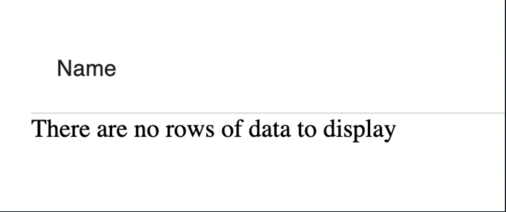
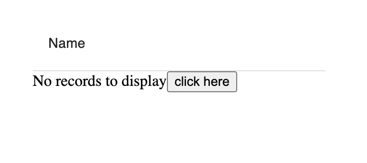

# hatchify

# About HatchifyJS

HatchifyJS is a web application framework designed to accelerate the
development of new, or enhancement of existing, CRUD applications. If
all you need is a simple CRUD application, HatchifyJS can provide you
with a fully functional system straight from your database schema. If
you have more specialized requirements, HatchifyJS makes it easy to
customize every part of the application to meet your needs.

HatchifyJS enables you to make changes to your database schema and
customize app behavior independently. When using code generation tools
you have to write your schema and then generate your code, but once you
start making customizations you cant re-run the generator without losing
your customizations.

HatchifyJS is NOT code generation, it's a system of modular and
hierarchical libraries that can be consumed piecemeal to use as much or
as little of HatchifyJS abilities as you require.

- [About HatchifyJS](#GettingStartedHatchify-AboutHatchifyJS)
- [Project Setup](#GettingStartedHatchify-ProjectSetup)
- [Schemas](#GettingStartedHatchify-Schemas)
  - [Model
    Relationships](#GettingStartedHatchify-ModelRelationships)
- [Backend - The Hatchify
  Middleware](#GettingStartedHatchify-Backend-TheHatchifyMiddleware)
  - [Using the server
    endpoints](#GettingStartedHatchify-Usingtheserverendpoints)
    - [Creating a
      resource](#GettingStartedHatchify-Creatingaresource)
    - [Listing
      resources](#GettingStartedHatchify-Listingresources)
    - [Fetching a single
      resource](#GettingStartedHatchify-Fetchingasingleresource)
    - [Updating a
      resource](#GettingStartedHatchify-Updatingaresource)
    - [Deleting a
      resource](#GettingStartedHatchify-Deletingaresource)
  - [Seeding data](#GettingStartedHatchify-Seedingdata)
- [Frontend with React &
  MUI](#GettingStartedHatchify-FrontendwithReact&MUI)
  - [Rendering a List](#GettingStartedHatchify-RenderingaList)
- [Next Steps](#GettingStartedHatchify-nextSteps)
  - [Rendering an empty list](#GettingStartedHatchify-renderingAnEmptyList)
- [Need help or have
  questions?](#GettingStartedHatchify-Needhelporhavequestions?)

# Project Setup

In this guide, we will be setting up one project containing a HatchifyJS
frontend and backend. Our frontend will use React & MUI and our backend
will be using Koa. We will be setting up our project using Vite so that
it handles all the React configurations for us.

[✏️](https://emojipedia.org/pencil/) Perform all the
following steps:

1.  Ensure you’re using [node 18 and npm
    9](https://nodejs.org/en/download)

    ```bash
    node -v
    ```

2.  Create a new Vite project titled “hatchify-app”:

    ```bash
    npm create vite@latest hatchify-app -- --template react-ts
    ```

3.  Move into the “hatchify-app” directory and install the node modules:

    ```bash
    cd hatchify-app
    npm install
    ```

4.  Install `koa`, `@koa/cors`, and the frontend and backend HatchifyJS
    libraries:

    ```bash
    npm install sequelize sqlite3 koa @koa/cors @hatchifyjs/koa @hatchifyjs/react
    ```

5.  Install the following dev packages to run our backend server:

    ```bash
    npm install @types/koa @types/koa__cors nodemon ts-node --save-dev
    ```

6.  Remove `"type": "module"` from `package.json` so that we can have
    consistent TS imports across our backend and frontend apps

7.  Overwrite the `scripts` in `package.json` with the following:

    ```bash
    "lint": "eslint src --ext ts,tsx --report-unused-disable-directives --max-warnings 0",
    "dev:frontend": "vite",
    "dev:backend": "nodemon --esm backend/index.ts",
    "build:frontend": "tsc && vite build --outDir dist/frontend",
    "build:backend": "tsc --outDir dist/backend --project tsconfig.backend.json",
    "start:frontend": "vite preview --outDir dist/frontend",
    "start:backend": "node dist/backend/backend/index.js"
    ```

8.  Create a “backend” directory at the root, this is where we will put
    our backend code:

    ```bash
    mkdir backend
    ```

9.  For consistency, we’re going to rename our “src” folder to
    “frontend”:

    ```bash
    mv src frontend
    ```

    1.  With this, we will also have to update line 11 in our
        `index.html` from `src="/src/main.tsx"` to
        `src="/frontend/main.tsx"`

10. Update your `tsconfig.json` to:

    ```json
    {
      "experimentalResolver": true,
      "compilerOptions": {
        "module": "NodeNext",
        "moduleResolution": "Node",
        "target": "ESNext",
        "lib": ["DOM", "DOM.Iterable", "ESNext"],
        "jsx": "react-jsx",
        "composite": true,
        "declaration": true,
        "incremental": true,
        "strict": true,
        "allowJs": false,
        "allowSyntheticDefaultImports": true,
        "downlevelIteration": true,
        "esModuleInterop": true,
        "forceConsistentCasingInFileNames": true,
        "isolatedModules": true,
        "noFallthroughCasesInSwitch": true,
        "noImplicitReturns": true,
        "noUnusedLocals": true,
        "resolveJsonModule": true,
        "skipLibCheck": true,
        "useDefineForClassFields": true
      },
      "include": ["frontend", "backend", "schemas", "vite.config.ts"],
      "exclude": ["node_modules"]
    }
    ```

11. Rename `tsconfig.node.json` to `tsconfig.backend.json` and update it
    to look like this:

    ```bash
    mv tsconfig.node.json tsconfig.backend.json
    ```

    ```json
    {
      "extends": "./tsconfig.json",
      "compilerOptions": {},
      "include": ["backend", "schemas"]
    }
    ```

# Schemas

A schema is a definition of a resource used in our HatchifyJS system. We
use these shared schemas across our backend and frontend to create
database tables, generate REST endpoints, and create React components
and data fetchers. Because these schemas are the backbone of our
frontend and backend HatchifyJS, we will place them in a `schemas/`
directory at the root directory of our project.

**✏️ Create a** `schemas` **directory:**

```bash
mkdir schemas
```

The required fields of the schema are a `name` for your model and the
`attributes` that will be held within it. If you have written ORM models
before, specifically Sequelize, this should look pretty familiar to you.
HatchifyJS uses Sequelize, a Node.js and TypeScript compatible ORM,
under the hood to talk to your database.

**✏️ Create a** `schemas/User.ts`**:**

```ts
// hatchify-app/schemas/User.ts
export const User = {
  name: "User",
  attributes: {
    name: "STRING",
  },
  hasMany: [{ target: "Todo", options: { as: "todos" } }], // 👀
}
```

**✏️ Create a** `schemas/Todo.ts`**:**

```ts
// hatchify-app/schemas/Todo.ts
export const Todo = {
  name: "Todo",
  attributes: {
    name: "STRING",
    due_date: "DATE",
    importance: "INTEGER",
  },
  belongsTo: [{ target: "User", options: { as: "user" } }], // 👀
}
```

You can find all of the possible [datatypes
here](https://sequelize.org/docs/v7/other-topics/other-data-types).

## Model Relationships

HatchifyJS can help you define and build complex relationships between
different models within your application. In the previous code snippet,
you may have noticed we added a `belongsTo` and `hasMany` to our
schemas. A model can have a relationship, linking it to another model.
These relationships can be defined using `hasMany`, `hasOne`,
`belongsTo`, and `belongsToMany`. The way we have defined the schemas
above, we are telling HatchifyJS that a `User` can be associated with
many different todos and that a `Todo` can only have 1 user associated
with it.

For more information on these relationships and the options available
check the [documentation for Sequelize](https://sequelize.org/docs/v7/category/associations/).

# Backend - The Hatchify Middleware

**✏️ Create an** `index.ts` **inside of the “backend” directory:**

```ts
// hatchify-app/backend/index.ts
import Koa from "koa"
import cors from "@koa/cors"
import { hatchifyKoa } from "@hatchifyjs/koa"
import { Todo } from "../schemas/Todo"
import { User } from "../schemas/User"

const app = new Koa()
const hatchedKoa = hatchifyKoa([Todo, User], {
  prefix: "/api",
  database: {
    dialect: "sqlite",
    storage: "example.sqlite",
  },
})

app.use(cors())
app.use(hatchedKoa.middleware.allModels.all)
;(async () => {
  await hatchedKoa.createDatabase()

  app.listen(3000, () => {
    console.log("Started on port 3000")
  })
})()
```

Now if we run our application, HatchifyJS will create CRUD application
endpoints for our `User` and `Todo` models automatically.

If you create additional schema files you can simply import them the
same way, passing them into the array in the HatchifyJS constructor.
This step will take care of not only adding your schema files, but also
validating them against each other, and setting up relationships for
you.

Next, we can start up the HatchifyJS to see everything in action.

```bash
npm run dev:backend
```

You can the browser with the following endpoints to list users and todo
(will have none at this point):

[http://localhost:3000/api/users](http://localhost:3000/api/users)

[http://localhost:3000/api/todos](http://localhost:3000/api/todos)

Now that we have our basic application up and running we can start
looking at how to make changes and further develop our example

## Using the server endpoints

You can now make requests to your endpoint to test your applications.

### Creating a resource

```bash
curl 'http://localhost:3000/api/todos' \
--header 'Content-Type: application/vnd.api+json' \
--data '{
  "data": {
    "type": "Todo",
    "attributes": {
      "name": "Walk the dog",
      "due_date": "2024-12-12",
      "importance": 6
    }
  }
}'
```

With Hatchify, you can make a POST request and assign its related record
in a single request following JSON:API.

```bash
curl --request POST 'http://localhost:3000/api/users' \
--header 'Content-Type: application/vnd.api+json' \
--data '{
  "data": {
    "type": "User",
    "attributes": {
      "name": "John Doe"
    },
    "relationships": {
      "todos": {
        "data": [
          { "type": "Todo", "id": "1" }
        ]
      }
    }
  }
}'
```

### Listing resources

You can make GET requests with HatchifyJS middleware and you can make
your requests even more powerful with query strings. You can check out
the [querystring
library](https://github.com/bitovi/querystring-parser)
for more information.

[http://localhost:3000/api/users](http://localhost:3000/api/users)
[http://localhost:3000/api/users?include=todos](http://localhost:3000/api/users?include=todos)
[http://localhost:3000/api/users?include=todos&filter\[name\]=John+Doe](http://localhost:3000/api/users?include=todos&filter%5Bname%5D=John+Doe)

### Fetching a single resource

Just like fetching a list of resources, we’re able to fetch an
individual resource with or without its related records.

[http://localhost:3000/api/users/1](http://localhost:3000/api/users/1)

[http://localhost:3000/api/users/1?include=todos](http://localhost:3000/api/users/1?include=todos)

### Updating a resource

```bash
curl --request PATCH 'http://localhost:3000/api/users/1' \
--header 'Content-Type: application/vnd.api+json' \
--data '{
  "data": {
    "type": "User",
    "id": "1",
    "attributes": {
      "name": "New name",
      "type": "User"
    },
    "relationships": {
      "todos": {
        "data": [
          {
            "id": "100",
            "type": "Todo"
          }
        ]
      }
    }
  }
}'
```

### Deleting a resource

```bash
curl --request DELETE 'http://localhost:3000/api/users/1'
```

## Seeding data

**✏️ Run the following commands in your terminal to seed some data**

```bash
curl 'http://localhost:3000/api/todos' \
--header 'Content-Type: application/vnd.api+json' \
--data '{
  "data": {
    "type": "Todo",
    "attributes": {
      "id": "101",
      "name": "Walk the dog",
      "due_date": "2024-12-12",
      "importance": 6
    }
  }
}'

curl 'http://localhost:3000/api/todos' \
--header 'Content-Type: application/vnd.api+json' \
--data '{
  "data": {
    "type": "Todo",
    "attributes": {
      "id": "102",
      "name": "Laundry",
      "due_date": "2024-12-02",
      "importance": 1
    }
  }
}'

curl 'http://localhost:3000/api/todos' \
--header 'Content-Type: application/vnd.api+json' \
--data '{
  "data": {
    "type": "Todo",
    "attributes": {
      "id": "103",
      "name": "Making Calls",
      "due_date": "2024-12-31",
      "importance": 7
    }
  }
}'

curl 'http://localhost:3000/api/users' \
--header 'Content-Type: application/vnd.api+json' \
--data '{
  "data": {
    "type": "User",
    "attributes": {
      "name": "John Doe"
    },
    "relationships": {
      "todos": {
        "data": [
          {
            "type": "Todo",
            "id": "101"
          },
          {
            "type": "Todo",
            "id": "103"
          }
        ]
      }
    }
  }
}'

curl 'http://localhost:3000/api/users' \
--header 'Content-Type: application/vnd.api+json' \
--data '{
  "data": {
    "type": "User",
    "attributes": {
      "name": "Jane Doe"
    },
    "relationships": {
      "todos": {
        "data": [
          {
            "type": "Todo",
            "id": "102"
          }
        ]
      }
    }
  }
}'
```

# Frontend with React & MUI

Now that our backend is configured and running, we can now use the same
schemas as defined earlier to quickly hatch our frontend. The first
thing we want to do is import `hatchifyReact`, `MuiProvider`, and
`createJsonapiClient` from the `@hatchify/react` library. Here’s a quick
overview of what each of these does:

- `createJsonapiClient` - This is our rest client for JSON:API. We
  pass in the `baseUrl` of our backend to it, as well as a mapping of
  `schema: { endpoint: <url endpoint>` to it.

- `MuiProvider` - This is an MUI theme provider that we must wrap
  around our entire app so that our HatchifyJS components will render
  with the correct design system.

- `createReact` - This function takes in our schemas and our rest
  client, it will then return an object containing components and rest
  functions for each schema. This returned object represents our
  entire frontend HatchifyJS app.

Once we create our HatchifyJS app, we can pull the `List` component from
the `Todo` key and render it.

## Rendering a List

**✏️ Modify the contents of** `frontend/main.tsx`**:**

- Get rid of the default Vite styles by removing line 4:
  `import './index.css'`

- Remove the extension from line 3, it should be:
  `import App from './App'`

`main.tsx` should look like:

```tsx
import React from "react"
import ReactDOM from "react-dom/client"
import App from "./App"

ReactDOM.createRoot(document.getElementById("root") as HTMLElement).render(
  <React.StrictMode>
    <App />
  </React.StrictMode>,
)
```

Now we can go ahead and create an instance of a HatchifyJS react app and
then render the List component for our todos.

**✏️ Overwrite the contents of** `frontend/App.tsx` **with the
following:**

```tsx
// hatchify-app/frontend/App.tsx
import { hatchifyReact, MuiProvider, createJsonapiClient } from "@hatchifyjs/react"
import { Todo } from "../schemas/Todo"
import { User } from "../schemas/User"

export const hatchedReact = hatchifyReact(
  { Todo, User },
  createJsonapiClient("http://localhost:3000/api", {
    Todo: { endpoint: "todos" },
    User: { endpoint: "users" },
  }),
)

const TodoList = hatchedReact.components.Todo.List

const App: React.FC = () => {
  return (
    <MuiProvider>
      <TodoList />
    </MuiProvider>
  )
}

export default App
```

**✏️**In another terminal, run `npm run dev:frontend` and open
[http://localhost:5173/](http://localhost:5173/). You
should see:


That’s it! With minimal code and some HatchifyJS magic, using our
well-defined schemas we have a backend running with REST endpoints, a
database, and a frontend that handles the JSX and data-fetching for us.

# Next Steps

* [Using Postgres DB](./doc/next-steps/using-postgres-db.md)

## Rendering an empty List

By default, the list will render a message in the list when there are no records to display:

To customize what is displayed here the `EmptyList` component can be passed into `List`

```tsx
// hatchify-app/src/App.tsx
const App: React.FC = () => {
  return (
    <MuiProvider>
      <TodoList>
        <TodoEmptyList>
          <div>No records to display</div>
        </TodoEmptyList>
      </TodoList>
    </MuiProvider>
  )
}
```

`EmptyList` will accept any custom component that is passed in as its children.


## Adding checkboxes to the list

To add a checkboxes column to the list, we must pass a `selectable` prop to the `List` component. If we want to extract the selected records, we must also pass a `onSelectionChange` prop. This prop is a callback function that will be called with the selected records whenever the selection changes.

```tsx
// hatchify-app/src/App.tsx
const App: React.FC = () => {
  const [selected, setSelected] = useState<string[]>([])

  return (
    <MuiProvider>
      <button onClick={() => alert(`action on [${selected.join(",")}]`)}>action</button>
      <TodoList selectable onSelectionChange={(ids) => setSelected(ids)}>
        <TodoEmptyList>
          <div>No records to display</div>
        </TodoEmptyList>
      </TodoList>
    </MuiProvider>
  )
}
```

# Troubleshooting / Known issues

```bash
TypeError [ERR_UNKNOWN_FILE_EXTENSION]: Unknown file extension ".ts" for .../hatchify-app/backend/index.ts
```

You might be on Node 20. If so, please use Node 18.

# Need help or have questions?

This project is supported by [Bitovi](https://bitovi.com/), a Javascript
consultancy. You can get help or ask questions on our:

- [Discord Community](https://discord.com/invite/J7ejFsZnJ4)

- [Twitter](https://twitter.com/bitovi)

Or, you can hire us for training, consulting, or development. [Set up a
free consultation.](https://www.bitovi.com/digital-consulting-services)
