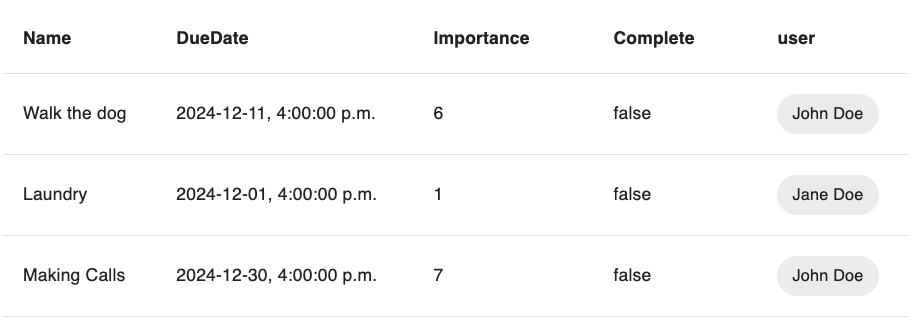

# HatchifyJS


HatchifyJS is a web application framework designed to accelerate the
development of new, or enhancement of existing, CRUD applications. If
all you need is a simple CRUD application, HatchifyJS can provide you
with a fully functional system straight from your database schema. If
you have more specialized requirements, HatchifyJS makes it easy to
customize every part of the application to meet your needs.

Unlike code generation tools—which allow you to write your schema and then generate your code, but can't preserve any customizations you may have made if you ever need to re-run the generator—HatchifyJS enables you to make changes to your database schema and customize app behavior **independently**. This is because HatchifyJS is **not** code generation. It's a system of modular and hierarchical libraries that can be consumed piecemeal to use as much or as little of HatchifyJS abilities as you require.

- [HatchifyJS](#hatchifyjs)
- [Project Setup](#project-setup)
- [Schemas](#schemas)
  - [Model Relationships](#model-relationships)
- [Backend - The Hatchify Middleware](#backend---the-hatchify-middleware)
  - [Using the server endpoints](#using-the-server-endpoints)
    - [Creating a resource](#creating-a-resource)
    - [Listing resources](#listing-resources)
    - [Fetching a single resource](#fetching-a-single-resource)
    - [Updating a resource](#updating-a-resource)
    - [Deleting a resource](#deleting-a-resource)
  - [Seeding data](#seeding-data)
- [Frontend with React & MUI](#frontend-with-react-and-mui)
  - [Rendering a List](#rendering-a-list)
- [Next Steps](#next-steps)
  - [Schema, database, and service API naming](./doc/naming.md)
  - [Using PostgreSQL DB](./doc/next-steps/using-postgres-db.md)
  - [Rendering an empty list](./doc/next-steps/customizing-what-is-displayed-in-an-empty-list.md)
  - [Adding checkboxes to the list](./doc/next-steps/adding-checkboxes-to-the-list.md)
  - [Learn how to filter data](./doc/filtering-data/filtering-data.md)
  - [Using virtual fields](./doc/next-steps/virtual-fields.md)
- [Troubleshooting / Known issues](#troubleshooting--known-issues)
- [Need help or have questions?](#need-help-or-have-questions)

# Project Setup

In this guide, we will be setting up a project containing a HatchifyJS
frontend and backend. Our frontend will use React and MUI, and our backend
will be using Koa. We will be setting up our project using Vite so that
it handles all the React configurations for us.

> **Note:** The ✏️ icon indicates when to follow along!

[✏️](https://emojipedia.org/pencil/) Perform all the
following steps:

1. Ensure you’re using [node 18 and npm
   9](https://nodejs.org/en/download)

   ```bash
   node -v
   npm -v
   ```

2. Create a new project:

   ```bash
   npm init @hatchifyjs@latest
   ```

# Schemas

A schema is a definition of a resource used in our HatchifyJS system. We
use these shared schemas across our backend and frontend to create
database tables, generate REST endpoints, and create React components
and data fetchers. Because these schemas are the backbone of our
frontend and backend, we will place them in the empty `schemas.ts`
file at the root directory of our project.

The required fields of the schema are a `name` for your model and the
`attributes` that will be held within it. If you have written ORM models
before, specifically Sequelize, this should look pretty familiar to you.
HatchifyJS uses Sequelize, a Node.js- and TypeScript-compatible ORM,
under the hood to talk to your database.

> **Note:** Take note of lines commented with the 👀 emoji.

```ts
// hatchify-app/schemas.ts
import { belongsTo, boolean, datetime, integer, hasMany, string } from "@hatchifyjs/core"
import type { PartialSchema } from "@hatchifyjs/core"

export const Todo = {
  name: "Todo",
  attributes: {
    name: string({ required: true }),
    dueDate: datetime(),
    importance: integer(),
    complete: boolean({ default: false }),
  },
  relationships: {
    user: belongsTo(),
  },
} satisfies PartialSchema

export const User = {
  name: "User",
  attributes: {
    name: string({ required: true }),
  },
  relationships: {
    todos: hasMany(),
  },
} satisfies PartialSchema
```

> **Note:** It is important to use _satisfies PartialSchema_ when typing our schemas. By using the satisfies keyword, we can make sure our schema objects are typed correctly and also get the benefit of type inference when passing our schemas into our hatchify functions.

You can find all of the possible data types for a schema's `attributes`
[here](https://sequelize.org/docs/v6/other-topics/other-data-types/).

## Model Relationships

HatchifyJS can help you define and build complex relationships between
different models within your application. In the previous code snippets,
you may have noticed we added a `belongsTo` and `hasMany` to our
schemas. A model can have a relationship, linking it to another model.
These relationships can be defined using `hasMany`, `hasOne`,
`belongsTo`, and `belongsToMany`. The way we have defined the schemas
above, we are telling HatchifyJS that a `User` can be associated with
many different todos and that a `Todo` can only have 1 user associated
with it.

For more information on these relationships and the options available
check the [documentation for Sequelize](https://sequelize.org/docs/v7/category/associations/).

# Backend - The Hatchify Middleware

Now if we run our application, HatchifyJS will create CRUD application
endpoints for our `User` and `Todo` models automatically.

If you create additional schema files you can simply import them the
same way, passing them into the array in the HatchifyJS constructor.
This step will take care of not only adding your schema files, but also
validating them against each other, and setting up relationships for
you.

Next, we can start up the backend to see everything in action. HatchifyJS will create CRUD application endpoints for our `User` and `Todo` models automatically.

If you create additional schemas, export them the same way. This step will take care of not only adding your schema files, but also
validating them against each other, and setting up relationships for
you.

```bash
npm run dev
```

You can navigate to the following endpoints to get a list of users and todos
(but we won't have any just yet):

[http://localhost:3000/api/users](http://localhost:3000/api/users)

[http://localhost:3000/api/todos](http://localhost:3000/api/todos)

Now that we have our basic backend up and running we can start
looking at how to make changes and further develop our example.

## Using the server endpoints

You can now make requests to your endpoint to test your applications. The following are examples of how to do this with `curl`, but you don't need to follow along just yet—we'll seed the database for our example app later on.

### Creating a resource

```bash
curl 'http://localhost:3000/api/todos' \
--header 'Content-Type: application/vnd.api+json' \
--data '{
  "data": {
    "type": "Todo",
    "id": "aaaaaaaa-aaaa-aaaa-aaaa-000000000001",
    "attributes": {
      "name": "Walk the dog",
      "dueDate": "2024-12-12",
      "importance": 6
    }
  }
}'
```

With Hatchify, you can make a POST request and assign its related record
in a single request, per the JSON:API spec.

```bash
curl --request POST 'http://localhost:3000/api/users' \
--header 'Content-Type: application/vnd.api+json' \
--data '{
  "data": {
    "type": "User",
    "id": "bbbbbbbb-bbbb-bbbb-bbbb-000000000001",
    "attributes": {
      "name": "John Doe"
    },
    "relationships": {
      "todos": {
        "data": [
          { "type": "Todo", "id": "aaaaaaaa-aaaa-aaaa-aaaa-000000000001" }
        ]
      }
    }
  }
}'
```

### Listing resources

You can make GET requests with HatchifyJS middleware, and you can make
your requests even more powerful with query strings. For example:

- [http://localhost:3000/api/users](http://localhost:3000/api/users)
- [http://localhost:3000/api/users?include=todos](http://localhost:3000/api/users?include=todos)
- [http://localhost:3000/api/users?include=todos&filter\[name\]=John+Doe](http://localhost:3000/api/users?include=todos&filter%5Bname%5D=John+Doe)

You can check out the [querystring library](https://github.com/bitovi/querystring-parser), which HatchifyJS uses under the hood, for more information.

### Fetching a single resource

Just like fetching a list of resources, we’re able to fetch an
individual resource with or without its related records. For example:

- [http://localhost:3000/api/users/66917da6-5ff8-11ee-8c99-0242ac120002](http://localhost:3000/api/users/bbbbbbbb-bbbb-bbbb-bbbb-000000000001)
- [http://localhost:3000/api/users/66917da6-5ff8-11ee-8c99-0242ac120002?include=todos](http://localhost:3000/api/users/bbbbbbbb-bbbb-bbbb-bbbb-000000000001?include=todos)

### Updating a resource

```bash
curl --request PATCH 'http://localhost:3000/api/users/bbbbbbbb-bbbb-bbbb-bbbb-000000000001' \
--header 'Content-Type: application/vnd.api+json' \
--data '{
  "data": {
    "type": "User",
    "id": "bbbbbbbb-bbbb-bbbb-bbbb-000000000001",
    "attributes": {
      "name": "New name",
      "type": "User"
    }
  }
}'
```

### Deleting a resource

```bash
curl --request DELETE 'http://localhost:3000/api/users/bbbbbbbb-bbbb-bbbb-bbbb-000000000001'
```

## Seeding data

**✏️ Run the following commands in your terminal to seed some data**

```bash
curl 'http://localhost:3000/api/todos' \
--header 'Content-Type: application/vnd.api+json' \
--data '{
  "data": {
    "type": "Todo",
    "attributes": {
      "id": "aaaaaaaa-aaaa-aaaa-aaaa-000000000002",
      "name": "Walk the dog",
      "dueDate": "2024-12-12",
      "importance": 6
    }
  }
}'

curl 'http://localhost:3000/api/todos' \
--header 'Content-Type: application/vnd.api+json' \
--data '{
  "data": {
    "type": "Todo",
    "attributes": {
      "id": "aaaaaaaa-aaaa-aaaa-aaaa-000000000003",
      "name": "Laundry",
      "dueDate": "2024-12-02",
      "importance": 1
    }
  }
}'

curl 'http://localhost:3000/api/todos' \
--header 'Content-Type: application/vnd.api+json' \
--data '{
  "data": {
    "type": "Todo",
    "attributes": {
      "id": "aaaaaaaa-aaaa-aaaa-aaaa-000000000004",
      "name": "Making Calls",
      "dueDate": "2024-12-31",
      "importance": 7
    }
  }
}'

curl 'http://localhost:3000/api/users' \
--header 'Content-Type: application/vnd.api+json' \
--data '{
  "data": {
    "type": "User",
    "attributes": {
      "name": "John Doe"
    },
    "relationships": {
      "todos": {
        "data": [
          {
            "type": "Todo",
            "id": "aaaaaaaa-aaaa-aaaa-aaaa-000000000002"
          },
          {
            "type": "Todo",
            "id": "aaaaaaaa-aaaa-aaaa-aaaa-000000000004"
          }
        ]
      }
    }
  }
}'

curl 'http://localhost:3000/api/users' \
--header 'Content-Type: application/vnd.api+json' \
--data '{
  "data": {
    "type": "User",
    "attributes": {
      "name": "Jane Doe"
    },
    "relationships": {
      "todos": {
        "data": [
          {
            "type": "Todo",
            "id": "aaaaaaaa-aaaa-aaaa-aaaa-000000000003"
          }
        ]
      }
    }
  }
}'
```

# Frontend with React and MUI

Now that our backend is configured and running we can use the same
schemas that we defined earlier to quickly "hatch" our frontend. The first
thing we want to do is import `hatchifyReact`, `MuiProvider`, and
`createJsonapiClient` from the `@hatchify/react` library. Here’s a quick
overview of what each of these does:

- `createJsonapiClient` - This is our rest client for JSON:API. We
  pass in the `baseUrl` of our backend to it, as well as our schemas.

- `MuiProvider` - This is an MUI theme provider that we must wrap
  around our entire app so that our HatchifyJS components will render
  with the correct design system.

- `createReact` - This function takes in our rest client and returns
  an object containing components and rest functions for each schema.
  This returned object represents our entire frontend HatchifyJS app.

Once we create our HatchifyJS app, we can pull the `Collection` component from
the `Todo` key and render it.

## Rendering a List

**✏️**Open
[http://localhost:3000/](http://localhost:3000/). You
should see:



And that’s it! With minimal code and some HatchifyJS magic, we've used our
well-defined schemas to create a database, a running backend with REST endpoints, and a frontend that handles the JSX and data-fetching for us.

# Next Steps

- [Schema, database, and service API naming](./doc/naming.md)
- [Using PostgreSQL DB](./doc/next-steps/using-postgres-db.md)
- [Rendering an empty list](./doc/next-steps/customizing-what-is-displayed-in-an-empty-list.md)
- [Adding checkboxes to the list](./doc/next-steps/adding-checkboxes-to-the-list.md)
- [Learn how to filter data](./doc/filtering-data/filtering-data.md)
- [Using virtual fields](./doc/next-steps/virtual-fields.md)

# Troubleshooting / Known issues

```bash
TypeError [ERR_UNKNOWN_FILE_EXTENSION]: Unknown file extension ".ts" for .../hatchify-app/backend/index.ts
```

You might be on Node 20. If so, please use Node 18.

# Need help or have questions?

This project is supported by [Bitovi](https://bitovi.com/), a Javascript
consultancy. You can get help or ask questions on our:

- [Discord Community](https://discord.com/invite/J7ejFsZnJ4)

- [Twitter](https://twitter.com/bitovi)

Or, you can hire us for training, consulting, or development. [Set up a
free consultation.](https://www.bitovi.com/digital-consulting-services)
