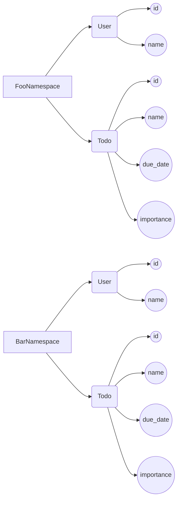

# Using Namespace Schemas with Postgres

This guide explains how to use Hatchify `namespace` with Postgres schemas.

In Postgres we could use

```SQL
create schema foo;
```

If we add a user table to it we could do

```SQL
select * from foo.user;
```

## Define models with namespaces

In Hatchify we could achieve the same thing of creating postgres schemas using `namespace` option.


```javaScript
Todo = {
  name:  "Todo",
  namespace:  "Foo", // Optional, defaults to 'Public'
  attributes: {
    name:  "STRING",
    due_date:  "DATE",
    importance:  "INTEGER",
  }
}
```

For example, to create 2 namespaces **FooNamespace** and **BarNamespace** with each having a **User** and a **Todo** Models, all we have to do is add `namespace` property to each model schema (SHOULD WE CALL it model ior schema?):

Note: The `namespace` value could be just "Foo" no need to have "Namespace" added to it, we use two words name to show later how to use the API.




```javaScript
const Schemas = {
  // FooNamespace schemas
  "FooNamespace.User": {
    name: "User",
    namespace: "FooNamespace",
    attributes: {
      title: STRING,
      // attributes here
    }
  }
  "FooNamespace.Todo": {
    name: "Todo",
    namespace: "FooNamespace",
    attributes: {
      name: "STRING",
      // attributes here
    }
  },

// BarNamespace schemas, could be put in their own file
  "BarNamespace.User": {
    name: "User",
    namespace: "BarNamespace",
    attributes: {
      // attributes here
    }
  },
  "Bar.Todo": {
    name: "Todo",
    namespace: "BarNamespace",
    attributes: {
      // attributes here
    },
    belongsTo: [{ target: "User"}],
  }
}

//...
// Schemas could accept both objects and arrays?
const hatchedKoa = hatchifyKoa(Schemas, {
    prefix: `/api/`,
  })
```

## API calls when using namespaces

To call the created API end-point remember the Service URL path names are `kebab-case`.  (Ex: `/foo-namespace`)

 _Note: Query parameters are `camelCase`._

```
GET /api/[namespace-name]/[schema]
```

In our example, to get all Users of ***FooNamespace*** we do:

```
GET /api/foo-namespace/users
```
If our namespace value was "Foo" we call the API with 

```
GET /api/foo/users
```

To include fields we can do:

```
GET /api/foo-namespace/todos?fields[FooNamespace.Todo]=name
```
_Note: When refering a fields that belongs to the same namespace we could omit it like:_
```
GET /api/foo-namespace/todos?fields[Todo]=name
```
