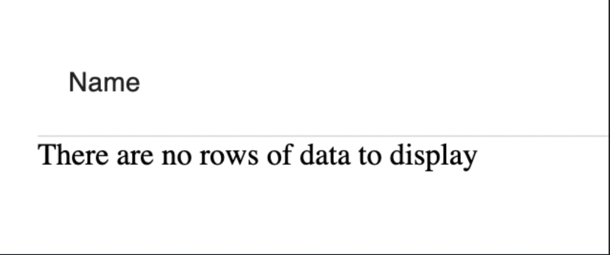
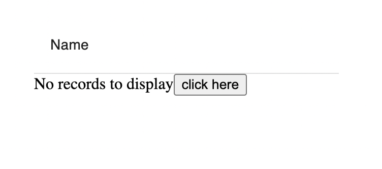

## Rendering an empty List

By default, a model's `List` component will render a message when there are no records to display:


To customize what is displayed here the `Empty` component can be passed into `Collection`

```tsx
// hatchify-app/src/App.tsx

const TodoList = hatchedReact.components.Todo.Collection
const TodoEmpty = hatchedReact.components.Todo.Empty

const App: React.FC = () => {
  return (
    <MuiProvider>
      <TodoList>
        <TodoEmptyList>
          <strong>No records to display</strong>
        </TodoEmptyList>
      </TodoList>
    </MuiProvider>
  )
}
```

`Empty` will accept any custom component that is passed in as its children.
