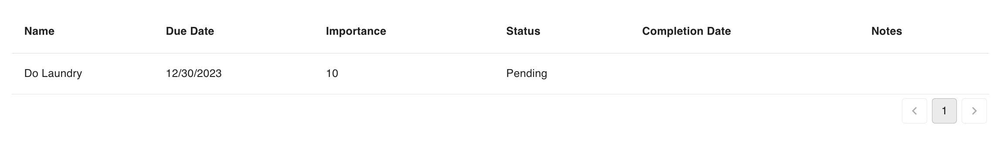

# @hatchifyjs/react components

@hatchifyjs/react has several components available to use in your React app. There are two sets of components to be used.

The hatchifyReact Components are included in the HatchifyApp, and have access to the state from the provider.

The Material UI components are intended for use in instances when customization is needed. These require using the `useDataGridState` hook and manually passed back in as a prop.

You can learn more about `useDataGridState` [here](./README.md).

- [hatchifyReact Components](#hatchifyreact-components)
  - [DataGrid](#hatchify-datagrid)
  - [Column](#hatchify-column)
  - [Empty](#hatchify-empty)
- [Material UI components](#material-ui-components)
  - [List](#list)
  - [Pagination](#pagination)
  - [Filters](#filters)
  - [DataGrid](#datagrid)

## hatchifyReact Components

### Hatchify DataGrid

Similar to the MUI DataGrid, the Hatchify `DataGrid` displays the records of a specific schema, but the state does not have to be passed in.

```tsx
//in App.tsx
const TodoDataGrid = hatchedReact.components.Todo.DataGrid  // 👀

const App: React.FC = () => {
  return (
    <ThemeProvider theme={createTheme()}>
      <HatchifyProvider>
        <TodoDataGrid/> {/* 👀 */}
      </HatchifyProvider>
    </ThemeProvider>
  )
}

```

### Hatchify Column

The `Column` component is used anytime there is a need to customize the output of a specific column. This can be used as a child of both the Hatchify `DataGrid` and the MUI `DataGrid`.

```tsx
//in App.tsx
const TodoColumn = hatchedReact.components.Todo.Column  // 👀

const App: React.FC = () => {
  return (
    <ThemeProvider theme={createTheme()}>
      <HatchifyProvider>
        <TodoDataGrid>
          <TodoColumn {/* 👀 */}
            label="Action"
            renderDataValue={({ record }) => {
              return (
                <>
                  <button onClick={() => console.log(record)}>
                    More Actions
                  </button>
                </>
              )
            }}
          />
        </TodoDataGrid>
      </HatchifyProvider>
    </ThemeProvider>
  )
}

```

Learn more about custom components in [this guide](../guides/customizing-your-list.md).

### Hatchify Empty

`Empty` is used to customize what is displayed when the Hatchify `DataGrid` has no records to display.

```tsx
//in App.tsx
const TodoEmptyList = hatchedReact.components.Todo.Empty  // 👀

const App: React.FC = () => {
  return (
    <ThemeProvider theme={createTheme()}>
      <HatchifyProvider>
        <TodoDataGrid> 
          <TodoEmptyList>No records to display</TodoEmptyList> {/* 👀 */}
        </TodoDataGrid>
      </HatchifyProvider>
    </ThemeProvider>
  )
}

```

Learn more about customizing `EmptyList` in [this guide](../guides/customizing-your-list.md).

## Material UI Components

@hatchifyjs/react provides access to the components directly separate from the Hatchify state layer. You can use this approach when needing to customize how the state of the records are displayed.

### List

`List` is used for displaying rows of records.

```tsx
//in App.tsx

const App: React.FC = () => {
  const todoState = hatchedReact.state.Todo.useDataGridState({
  include: ["user"]
}) // 👀

  return (
    <ThemeProvider theme={createTheme()}>
      <HatchifyProvider>
        <List {...todoState}>{/* 👀 */}
          <TodoEmptyList>No records to display</TodoEmptyList>
        </List>
      </HatchifyProvider>
    </ThemeProvider>
  )
}

```


### Pagination

`Pagination` is used for paginating data in the table.

```tsx
//in App.tsx

const App: React.FC = () => {
  const todoState = hatchedReact.state.Todo.useDataGridState({
  include: ["user"]
}) // 👀

  return (
    <ThemeProvider theme={createTheme()}>
      <HatchifyProvider>
        <List {...todoState}> {/* 👀 */}
          <TodoEmptyList>No records to display</TodoEmptyList>
        </List>
        <Pagination {...state} />
      </HatchifyProvider>
    </ThemeProvider>
  )
}

```



### Filters

`Filters` is used for filtering data in the table.

```tsx
//in App.tsx

const App: React.FC = () => {
  const todoState = hatchedReact.state.Todo.useDataGridState({
  include: ["user"]
}) // 👀

  return (
    <ThemeProvider theme={createTheme()}>
      <HatchifyProvider>
        <Filters {...todoState} /> {/* 👀 */}
        <List {...todoState}> {/* 👀 */}
          <TodoEmptyList>No records to display</TodoEmptyList>
        </List>
        <Pagination {...todoState} />
      </HatchifyProvider>
    </ThemeProvider>
  )
}

```


### DataGrid

`DataGrid` is used for displaying records. This component is comprised of `Filters`, `List`, and `Pagination`

```tsx
//in App.tsx

const App: React.FC = () => {
  const todoState = hatchedReact.state.Todo.useDataGridState({
  include: ["user"]
}) // 👀

  return (
    <ThemeProvider theme={createTheme()}>
      <HatchifyProvider>
        <DataGrid {...todoState}>{/* 👀 */}
          <TodoEmptyList>No records to display</TodoEmptyList>
        </DataGrid>
      </HatchifyProvider>
    </ThemeProvider>
  )
}

```
