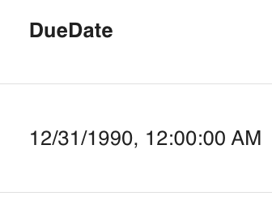
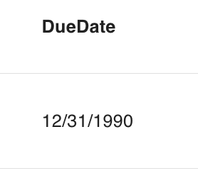

# datetime({min, max, default, required, step})

Defines an attribute as being a date type that includes the **time**.

```ts
export const Todo: PartialSchema = {
  name: "Todo",
  attributes: {
    dueDate: datetime({ required: true }),
  },
}
```

Use [dateonly] for a date type without time.

## Parameters

| key        | description                                                                                                               |      type       | optional |   default   |
| ---------- | ------------------------------------------------------------------------------------------------------------------------- | :-------------: | :------: | :---------: |
| `default`  | The default value of the attribute. <br/> Example: `datetime({default: 2023-10-02T21:16:15.349Z})`                        |     `Date`      |   Yes    | `undefined` |
| `required` | If the attribute must be provided. <br/> Example: `datetime({required: true})`                                            |    `Boolean`    |   Yes    |   `false`   |
| `primary`  | If the attribute is a primary key. <br/> Example: `datetime({primary: true})`                                             |    `Boolean`    |   Yes    |   `false`   |
| `unique`   | If the attribute must be unique. <br/> Example: `datetime({unique: true})`                                                |    `Boolean`    |   Yes    |   `false`   |
| `max`      | The max date allowed. <br/> Example: `datetime({max: new Date()})`, `datetime({max: 1696283660000})`                      | `Date, number`  |   Yes    | `undefined` |
| `min`      | The min date allowed. <br/> Example: `datetime({min: new Date()})`, `datetime({min: 1696283660000})`                      | `Date, number`  |   Yes    | `undefined` |
| `step`     | The spacing between dates in either milliseconds or "day" <br/> Example: `datetime({step: "day"})`, `datetime({step: 7})` | `"day", number` |   Yes    | `undefined` |

## Database and Sequelize Behavior

The `datetime` and `dateonly` types will create sequelize [DataTypes.DATE/DATEONLY](https://sequelize.org/docs/v6/core-concepts/model-basics/#dates) columns, respectively.

## Middleware Behavior

### Querying Data

For dates, use an `1990-12-31T06:00:00.000Z`, `1990-12-31` value, in your queries as follows:

GET /todos?filter[dueDate][$eq]=2023-12-01T20%3A00%3A00.000Z //all todos with a due date that matches 2023-12-01T20%3A00%3A00.000Z

GET /todos?filter[dueDate][$gte]=2023-12-01T20%3A03%3A00.000Z //all todos that are on or after 2023-12-01T20%3A00%3A00.000Z

Any other value type will return a service error.

Checkout the [compatibility table](../../filtering-data/filtering-data.md#compatibility) for what operators can be used with dates

### Data Response

Dateonly and datetime data will be returned as `1990-12-31T06:00:00.000Z`, `1990-12-31`, or `null` as follows:

```js
{
  data: {
    ...
    attributes: {
      ...
      dueDate: "1990-12-31T06:00:00.000Z"
    }
  }
}
```

### Mutating Data

When creating or updating a datetime or dateonly attribute, a valid date in the form of `1990-12-31T06:00:00.000Z`, `1990-12-31`, or `null` must be provided. Any other value type will return a service error.

When `datetime` is given a step of `"day"`, a valid date must be in the form of `1990-12-31`, or `null`, Any other value type will return a service error.

Note: Both formats work with both date types. If a `datetime` attribute is created/updated with `1990-12-31` the returned value will be `1990-12-31T06:00:00.000Z`. For `dateonly`, the opposite is true. Any time portion used in creating/updating the attribute will be truncated.

## React Rest Behavior

Similar to the middleware, you MUST provide react rest models a valid date in the form of `1990-12-31T06:00:00.000Z`, `1990-12-31`, or `null` value. Likewise, they will always return these values:

```ts
Todo.createOne({ attributes: { dueDate: "1990-12-31T06:00:00.000Z" } })

const [todo, todoMeta] = hatchedReactRest.Todo.useOne({ id })
todo.dueDate //-> "1990-12-31T06:00:00.000Z", "1990-12-31", null, or undefined
```

## Grid Behavior

The text date values will be presented in the grid. If the value is `null` or `undefined`, no value will be presented in the grid.




Note: The displayed values will be formatted to your locale.

## Form Behavior

`datetime()` will result in a [`<input type="datetime-local">`](https://developer.mozilla.org/en-US/docs/Web/HTML/Element/input/datetime-local) control
with minute resolution.

`datetime({ step: "day" })` will result in a [`<input type="datetime-local">`](https://developer.mozilla.org/en-US/docs/Web/HTML/Element/input/datetime-local) control
with minute resolution.

`dateonly()` in a [`<input type="date">`](https://developer.mozilla.org/en-US/docs/Web/HTML/Element/input/date) control with day resolution.

Currently, any other step value will result in a [`<input type="datetime-local">`](https://developer.mozilla.org/en-US/docs/Web/HTML/Element/input/datetime-local) control which will be validated after the value is set.
