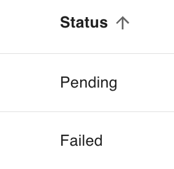

# enumerate({default, primary, values, required, unique})

Defines an attribute belonging to a set of constant string values. The `values` attribute specifies the array of possible string values that each record may choose it's value from.

```ts
export const Todo = {
  name: "Todo",
  attributes: {
    status: enumerate({ values: ["Pending", "Failed", "Completed"] }),
  },
} satisfies PartialSchema
```

## Parameters

| key        | description                                                                                       |      type      | optional |   default   |
| ---------- | ------------------------------------------------------------------------------------------------- | :------------: | :------: | :---------: |
| `default`  | The default value of the attribute. <br/> Example: `enumerate({default: "Pending", values:[...])` |    `String`    |   Yes    | `undefined` |
| `primary`  | If the attribute is a primary key. <br/> Example: `enumerate({primary: true, values:[...])`       |   `Boolean`    |   Yes    |   `false`   |
| `values`   | The options of the enum <br/> Example: `enumerate({values: ["Pending", "Failed", "Completed"]})`  | `String Array` |    No    |             |
| `required` | If the attribute must be provided. <br/> Example: `enumerate({required: true, values:[...])`      |   `Boolean`    |   Yes    |   `false`   |
| `unique`   | If the attribute must be unique. <br/> Example: `enumerate({unique: true, values:[...]})`         |   `Boolean`    |   Yes    |   `false`   |

## Database Implications

The `enumerate` type will create a sequelize [DataTypes.ENUM](https://sequelize.org/docs/v6/other-topics/other-data-types/#enums) column.

## Middleware Behavior

### Querying Data

```
GET /api/todos?filter[status][$eq]=Pending  // all todos with status of Pending
GET /api/todos?filter[status][$eq]=%00  // all todos with no status
GET /api/todos?filter[status][$in][]=Pending&[status][$in][]=Failed  // all todos with status of either Pending or Failed.
```

### Data Response

String data will be returned as a string value or `null` as follows:

```js
{
  data: {
    ...
    attributes: {
      status: "Pending" // or null
    }
  }
}
```

### Mutating Data

When creating or updating an enumerate attribute, one of the defined values or `null` (if not required) must be provided. Any other value will return a service error.

```js
POST /api/todos

DATA:

{
  data: {
    ...
    attributes: {
      status: "ENUM VALUE" // or null
    }
  }
}
```

## Grid Behavior

The enum value in its entirety is shown as a string. Null values are shown as an empty table cell.


