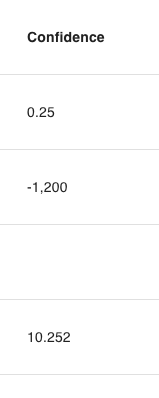

# number({autoIncrement, min, max, step, primary, required, default, unique})

Defines an attribute as being a number.

```ts
export const Todo = {
  name: "Todo",
  attributes: {
    confidence: number({ required: true }),
  },
} satisfies PartialSchema
```

## Parameters

| key             | description                                                                        |   type    | optional |        default        |
| --------------- | ---------------------------------------------------------------------------------- | :-------: | :------: | :-------------------: |
| `unique`        | If the value must be unqiue. <br/> Example: `number({unique: true})`               | `Boolean` |   Yes    |        `false`        |
| `default`       | The default value of the attribute. <br/> Example: `number({default: 0})`          | `Number`  |   Yes    |        `null`         |
| `required`      | If the attribute must be provided. <br/> Example: `number({required: true})`       | `Boolean` |   Yes    |        `false`        |
| `primary`       | If the attribute is a primary key. <br/> Example: `number({primary: true})`        | `Boolean` |   Yes    |        `false`        |
| `step`          | The granularity the value must adhere to. <br/> Example: `number({step: 5})`       | `Number`  |   Yes    |          `0`          |
| `max`           | The maximum value allowed. <br/> Example: `number({max: 100})`                     | `Number`  |   Yes    | `Number.MAX_VALUE` 🛑 |
| `min`           | The minimum value allowed. <br/> Example: `number({min: -100})`                    | `Number`  |   Yes    | `Number.MIN_VALUE` 🛑 |
| `autoIncrement` | If the value should be incremented. <br/> Example: `number({autoIncrement: true})` | `Boolean` |   Yes    |        `false`        |

## Database and Sequelize Behavior

The `number` type will create a sequelize [DataTypes.DECIMAL](https://sequelize.org/docs/v6/core-concepts/model-basics/#numbers) column.

## Middleware Behavior

### Querying Data

For numbers, use any number value and `%00` in your queries as follows:

```js
// all todos with confidence >= 5.3
GET /api/todos?filter[confidence][$gte]=5.3

// all todos with confidence = null
GET /api/todos?filter[confidence][$eq]=%00

 // all todos with confidence = 1 or =1.5
GET /api/todos?filter[confidence][$in][]=1&filter[confidence][$in][]=-1.5
```

Any other value will return a service error.

Checkout the [compatibility table](../../filtering-data/README.md#compatibility) for what operators can be used with numbers.

### Data Response

Number data will be returned as a number:

```js
{
  data: {
    ...
    attributes: {
      confidence: 12.0
    }
  }
}
```

### Mutating Data

When creating or updating an number attribute, A number or `null` must be provided. Any other value will return a service error.

## React Rest Behavior

Similar to the middleware, you MUST provide react rest models a number or `null` value. Likewise, they will always return these values:

```ts
Todo.createOne({ attributes: { confidence: 0.0 } })

const [todo, todoMeta] = hatchedReactRest.Todo.useOne({ id })
todo.confidence //-> number or null
```

## Grid Behavior

The number value will be presented in the grid. If the value is `null`, no value will be presented in the grid.



## Form Behavior 🛑

`number()` will produce a [`<input type="number">`](https://developer.mozilla.org/en-US/docs/Web/HTML/Element/input/number) control. Empty values will be treated as `null`.
