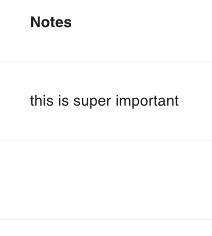

# text({default, required})

Defines an attribute as having unlimited text length.

```ts
export const Todo: PartialSchema = {
  name: "Todo",
  attributes: {
    description: text({ required: true }),
  }
}
```

## Parameters

|      key      | description                                                              | type            | optional  | default |
| ------------- | ------------------------------------------------------------------------ | :-------------: | :-------: | :-----: | 
| `default`     | The default value of the attribute. <br/> Example: `text({default: true})`  | `String`        | Yes       |         |
| `required`    | If the attribute must be provided.  <br/> Example: `text({required: true})` | `Boolean`       | Yes       | `false` |

## Database and Sequelize Behavior

The `text` type will create a sequelize [DataTypes.TEXT](https://sequelize.org/docs/v6/core-concepts/model-basics/#strings) column.

## Middleware Behavior

### Querying Data

For text, use any string value in your queries as follows:

```js
GET /todos?filter[notes][$eq]=this%20is%20super%20important //all todos with notes that equal "this is super important"
GET /todos?filter[notes][$eq]=null //all todos with notes that are null
GET /todos?filter[notes][$ilike]=%25important //all todos with notes that end in "important"
GET /todos?filter[notes][$ilike]=this%25 //all todos with notes that start with "this"
GET /todos?filter[notes][$ilike]=%25is%20super%25 //all todos with notes that contain "is super"
```

Note:
`%25` is the ASCII value for `%`, and serves as a wildcard in `ilike` queries
`%20` is the ASCII value for space.

### Data Response

Text data will be returned as a string:

```js
{
  data: {
    ...
    attributes: {
      ...
      notes: "this is super important",
    },
  }
}
```

### Mutating Data

When creating or updating a text attribute, a string value, or `null` must be provided. Any other value will return a service error.

## React Rest Behavior
Similar to the middleware, you MUST provide react rest models a string value, or `null`. Likewise, they will always return these values:

```ts
Todo.createOne({ attributes: { notes: "this is super important" } })

const [todo, todoMeta] = hatchedReactRest.Todo.useOne({ id })
todo.notes //-> string or null
```

## Grid Behavior

The text will be presented in the grid. If the value is `null`, no value will be presented in the grid.



## Form Behavior

`text()` will produce a [`<textarea>`](https://developer.mozilla.org/en-US/docs/Web/HTML/Element/textarea) control.
