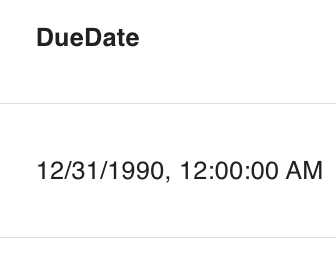

# datetime({min, max, default, primary, unique, required, step})

Defines an attribute as being a date type that includes the **time**.

```ts
export const Todo = {
  name: "Todo",
  attributes: {
    dueDate: datetime({ required: true }),
  },
} satisfies PartialSchema
```

Use [dateonly](./dateonly.md) for a date type without time.

## Parameters

| key              | description                                                                                                                                     |      type      | optional |   default   |
| ---------------- | ----------------------------------------------------------------------------------------------------------------------------------------------- | :------------: | :------: | :---------: |
| `default`        | The default value of the attribute. <br/> Example: `datetime({default: 2023-10-02T21:16:15.349Z})`                                              |     `Date`     |   Yes    | `undefined` |
| `required`       | If the attribute must be provided. <br/> Example: `datetime({required: true})`                                                                  |   `Boolean`    |   Yes    |   `false`   |
| `primary`        | If the attribute is a primary key. <br/> Example: `datetime({primary: true})`                                                                   |   `Boolean`    |   Yes    |   `false`   |
| `unique`         | If the attribute must be unique. <br/> Example: `datetime({unique: true})`                                                                      |   `Boolean`    |   Yes    |   `false`   |
| `max`            | The max date allowed. <br/> Example: `datetime({max: new Date()})`, `datetime({max: 1696283660000})`                                            | `Date, number` |   Yes    | `undefined` |
| `min`            | The min date allowed. <br/> Example: `datetime({min: new Date()})`, `datetime({min: 1696283660000})`                                            | `Date, number` |   Yes    | `undefined` |
| `step`           | The spacing between dates in either milliseconds or "day" <br/> Example: `datetime({step: "day"})`                                              |    `"day"`     |   Yes    | `undefined` |
| `ui.displayName` | The display name of the attribute. By default, the Camel Case attribute name will be used. <br/> Example: `datetime({displayName: "Due Date"})` |    `String`    |   Yes    |   `null`    |
| `ui.hidden`      | If the attribute should be hidden in the UI. <br/> Example: `datetime({hidden: true})`                                                          |   `Boolean`    |   Yes    |   `false`   |

### 💾 Database Implications

The `datetime` type will create sequelize [DataTypes.DATE](https://sequelize.org/docs/v6/core-concepts/model-basics/#dates) column.

### ↔️ API Implications

**_Querying Data_**

For dates, use a `1990-12-31T06:00:00.000Z` value, in your queries as follows:

```js
GET /api/todos?filter[dueDate][$eq]=2023-12-01T20%3A00%3A00.000Z // all todos with a due date that matches 2023-12-01T20%3A00%3A00.000Z

GET /api/todos?filter[dueDate][$gte]=2023-12-01T20%3A03%3A00.000Z // all todos that are on or after 2023-12-01T20%3A00%3A00.000Z
```

Any other value type will return a service error.

Checkout the [compatibility table](../../jsonapi/reading/filtering/README.md#compatibility) for what operators can be used with dates

**_Data Response_**

Datetime data will be returned as `1990-12-31T06:00:00.000Z`, or `null` as follows:

```js
{
  data: {
    ...
    attributes: {
      ...
      dueDate: "1990-12-31T06:00:00.000Z"
    }
  }
}
```

**_Mutating Data_**

When creating or updating a datetime attribute, a valid date in the form of `1990-12-31T06:00:00.000Z`, `1990-12-31`, or `null` must be provided. Any other value type will return a service error.

When `datetime` is given a step of `"day"`, a valid date must be in the form of `1990-12-31`, or `null`, Any other value type will return a service error.

Note: Both formats work with both date types. If a `datetime` attribute is created/updated with `1990-12-31` the returned value will be `1990-12-31T06:00:00.000Z`.

## React Rest Behavior

Similar to the API, you MUST provide react rest models a valid date in the form of `1990-12-31T06:00:00.000Z`, `1990-12-31`, or `null` value. Likewise, they will always return these values:

```ts
Todo.createOne({ attributes: { dueDate: "1990-12-31T06:00:00.000Z" } })

const [todo, todoMeta] = hatchedReactRest.Todo.useOne({ id })
todo.dueDate //-> "1990-12-31T06:00:00.000Z", null, or undefined
```

## Data Grid Behavior

The text date values will be presented in the data grid. If the value is `null` or `undefined`, no value will be presented in the data grid.



Note: The displayed values will be formatted to your locale.

## Form Behavior 🛑

`datetime()` will result in a [`<input type="datetime-local">`](https://developer.mozilla.org/en-US/docs/Web/HTML/Element/input/datetime-local) control
with minute resolution.

`datetime({ step: "day" })` will result in a [`<input type="datetime-local">`](https://developer.mozilla.org/en-US/docs/Web/HTML/Element/input/datetime-local) control
with day resolution.
