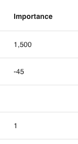

# integer({autoIncrement, min, max, step, primary, required, default, unique})

Defines an attribute as being an integer.

```ts
export const Todo = {
  name: "Todo",
  attributes: {
    importance: integer({ required: true }),
  },
} satisfies PartialSchema
```

## Parameters

| key             | description                                                                         |   type    | optional |            default            |
| --------------- | ----------------------------------------------------------------------------------- | :-------: | :------: | :---------------------------: |
| `unique`        | If the value must be unqiue. <br/> Example: `integer({unique: true})`               | `Boolean` |   Yes    |            `false`            |
| `default`       | The default value of the attribute. <br/> Example: `integer({default: 0})`          | `Integer` |   Yes    |            `null`             |
| `required`      | If the attribute must be provided. <br/> Example: `integer({required: true})`       | `Boolean` |   Yes    |            `false`            |
| `primary`       | If the attribute is a primary key. <br/> Example: `integer({primary: true})`        | `Boolean` |   Yes    |            `false`            |
| `step`          | The granularity the value must adhere to. <br/> Example: `integer({step: 5})`       | `Integer` |   Yes    |              `1`              |
| `max`           | The maximum value allowed. <br/> Example: `integer({max: 100})`                     | `Integer` |   Yes    | `Number.MAX_SAFE_INTEGER` 🛑  |
| `min`           | The minimum value allowed. <br/> Example: `integer({min: 1})`                       | `Integer` |   Yes    | `-Number.MIN_SAFE_INTEGER` 🛑 |
| `autoIncrement` | If the value should be incremented. <br/> Example: `integer({autoIncrement: true})` | `Boolean` |   Yes    |            `false`            |

### 💾 Database Implications

The `integer` type will create a sequelize [DataTypes.INTEGER](https://sequelize.org/docs/v6/core-concepts/model-basics/#numbers) column.

### ↔️ API Implications

**_Querying Data_**

For integers, use any whole number value and `%00` in your queries as follows:

```js
GET /api/todos?filter[importance][$gte]=5 // all todos with importance >= 5

GET /api/todos?filter[importance][$eq]=%00 // all todos with importance = null

GET /api/todos?filter[importance][$in][]=1&filter[importance][$in][]=2 // all todos with importance = 1 or 2
```

Any other value will return a service error.

Checkout the [compatibility table](../../filtering-data/README.md#compatibility) for what operators can be used with integers.

**_Data Response_**

Integer data will be returned as a number:

```js
{
  data: {
    ...
    attributes: {
      importance: 7
    }
  }
}
```

**_Mutating Data_**

When creating or updating an integer attribute, A whole number or `null` must be provided. Any other value will return a service error.

## React Rest Behavior

Similar to the API, you MUST provide react rest models a whole number or `null` value. Likewise, they will always return these values:

```ts
Todo.createOne({ attributes: { importance: 0 } })

const [todo, todoMeta] = hatchedReactRest.Todo.useOne({ id })
todo.importance //-> number or null
```

## Data Grid Behavior

The integer value will be presented in the data grid. If the value is `null`, no value will be presented in the data grid.



## Form Behavior 🛑

`integer()` will produce a [`<input type="number" step="1">`](https://developer.mozilla.org/en-US/docs/Web/HTML/Element/input/number) control. Empty values will be treated as `null`.
