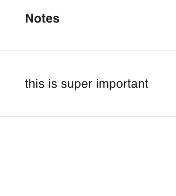

# text({default, required})

Defines an attribute as having unlimited text length.

```ts
export const Todo = {
  name: "Todo",
  attributes: {
    description: text({ required: true }),
  },
} satisfies PartialSchema
```

## Parameters

| key        | description                                                                     |   type    | optional | default |
| ---------- | ------------------------------------------------------------------------------- | :-------: | :------: | :-----: |
| `default`  | The default value of the attribute. <br/> Example: `text({default: 'no text'})` | `String`  |   Yes    |         |
| `required` | If the attribute must be provided. <br/> Example: `text({required: true})`      | `Boolean` |   Yes    | `false` |
| `primary`  | The attribute is a primary key. <br/> Example: `text({primary: true})`          | `Boolean` |   Yes    | `false` |
| `unique`   | The attribute must be unique. <br/> Example: `text({unique: true})`             | `Boolean` |   Yes    | `false` |

### 💾 Database Implications

The `text` type will create a sequelize [DataTypes.TEXT](https://sequelize.org/docs/v6/core-concepts/model-basics/#strings) column.

### ↔️ API Implications

**_Querying Data_**

For text, use any string value, or `%00` in your queries as follows:

```js
GET /api/todos?filter[notes][$eq]=this%20is%20super%20important // all todos with notes that equal "this is super important"

GET /api/todos?filter[notes][$eq]=%00 // all todos with notes that are null

GET /api/todos?filter[notes][$ilike]=%25important // all todos with notes that end in "important"

GET /api/todos?filter[notes][$ilike]=this%25 // all todos with notes that start with "this"

GET /api/todos?filter[notes][$ilike]=%25is%20super%25 // all todos with notes that contain "is super"
```

Note:
`%25` is the ASCII value for `%`, and serves as a wildcard in `ilike` queries.
`%20` is the ASCII value for space.

**_Data Response_**

Text data will be returned as a string:

```js
{
  data: {
    ...
    attributes: {
      ...
      notes: "this is super important",
    },
  }
}
```

**_Mutating Data_**

When creating or updating a text attribute, a string value, or `null` must be provided. Any other value will return a service error.

## React Rest Behavior

Similar to the API, you MUST provide react rest models a string value, or `null`. Likewise, they will always return these values:

```ts
Todo.createOne({ attributes: { notes: "this is super important" } })

const [todo, todoMeta] = hatchedReactRest.Todo.useOne({ id })
todo.notes //-> string or null
```

## Data Grid Behavior

The text will be presented in the data grid. If the value is `null`, no value will be presented in the data grid.

To provide better table behavior for columns with large amounts of text the `maxDisplayLength` property can also be provided. This will truncate oversized text, appending it with an ellipsis. The unabridged text will be available in a pop over. 🛑



## Form Behavior 🛑

`text()` will produce a [`<textarea>`](https://developer.mozilla.org/en-US/docs/Web/HTML/Element/textarea) control.
