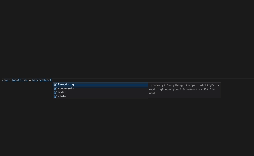

# @hatchifyjs/react

@hatchifyjs/react is a schema-driven library of components and helper methods for a Hatchify + React frontend. By providing the schemas (AKA models) of your backend resources, @hatchifyjs/react returns a set of components and helper functionality that you can use across your React app.

`@hatchifyjs/react` is a TypeScript supported [NPM package](https://www.npmjs.com/package/@hatchifyjs/react) that takes your [JSON:API rest client](#createjsonapiclient) and[Schema(s)](../schema/README.md) to produce custom:

- components
- helper functions
- generated [types](#types)

The following uses `hatchifyReact`to create a `hatchedReact` app with the defined `Todo` and `User` schemas.

```tsx
import { hatchifyReact, HatchifyProvider, createJsonapiClient } from "@hatchifyjs/react"

// Define the Schema(s)
export const Schemas = {
  Todo: {
    name: "Todo",
    attributes: {
      name: string(),
      status: enumerate({ values: ["Pending", "Failed", "Completed"] }),
    },
    relationships: {
      user: belongsTo("User"),
    },
  },
  User: {
    name: "User",
    attributes: {
      name: string(),
    },
    relationships: {
      todos: hasMany(),
    },
  },
} satisfies Record<string, PartialSchema>

// Create the Hatched React App instance
const hatchedReact = hatchifyReact(createJsonapiClient("/api", Schemas))

// Define variables for your Hatchify schema generated components
const TodoDataGrid = hatchedReact.components.Todo.DataGrid
const TodoColumn = hatchedReact.components.Todo.Column
const TodoEmptyDataGrid = hatchedReact.components.Todo.Empty

// Render your React Functional Component
const App: React.FC = () => {
  return (
    <HatchifyProvider>
      <button onClick={onActionClick} style={{ margin: 10 }}>
        action
      </button>
      <TodoDataGrid defaultSort={{ direction: "asc", sortBy: "id" }}>
        <TodoEmptyDataGrid>No records to display</TodoEmptyDataGrid>
        <TodoColumn
          label="Action"
          renderDataValue={({ record }) => {
            return (
              <>
                <button onClick={() => console.log(record)}>Download</button>
                <button onClick={() => console.log(record)}>Open</button>
                <button onClick={() => console.log(record)}>More Actions</button>
              </>
            )
          }}
        />
      </TodoDataGrid>
    </HatchifyProvider>
  )
}

export default App
```

[!IMPORTANT]
The `HatchifyProvider` wraps all Hatchify components to manage their internal states. See [HatchifyProvider](#hatchifyprovider) for more information.

- [Exports](#exports)
  - hatchifyReact - Constructs a `hatchedReact` app instance with custom components,helper functions, and type definitions
  - HatchifyProvider - A component that hosts and provides access to Hatchify-related state
  - createJsonapiClient - Creates a new [JSON:API rest client](#createjsonapiclient) using the defined schemas
- [`hatchedReact`]() -[`hatchedReact.Everything`](#hatchedReact.Everything) -[`hatchedReact.components`](#hatchedReact.components) -[`hatchedReact.state`](#hatchedReact.state) -[`hatchedReact.model`](#hatchedReact.model)

## Exports

```ts
import { createJsonapiClient, hatchifyReact, HatchifyProvider } from "@hatchifyjs/react"
```

### createJsonapiClient

`createJsonapiClient(baseUrl: string, schemaMap: Schemas)` is a constructor function that creates a new JSON:API rest client from the defined schemas. It accepts a base url, and schema set. For more documentation see [here](./rest-client.md) 🛑.

**Parameters**
`createJsonapiClient` takes two arguments `baseUrl` and `schemaMap`
`baseUrl` is a `string` that references the base url for the rest client
`schemaMap` is a collectionn of [Hatchify Schemas](../schema/README.md)

**Returns**

Returns a `JSON:API rest client` instance object

### hatchifyReact

`hatchifyReact(createJsonapiClient("/api", Schemas))` is a `Function` that initializes the `HatchifyApp` object from the JSON:API rest client. Inside of the object you will find [`components`](), [`model`](), [`state`](), and [`Everything`]().

```ts
import {createJsonapiClient, hatchifyReact} from "@hatchifyjs/react"

const schemas = { ... }

const hatchedReact = hatchifyReact(createJsonapiClient("/api", Schemas))
```

### HatchifyProvider

`HatchifyProvider` is a component that hosts and provides access to Hatchify-related state. It must be a parent to any Hatchify components.

```tsx
import {HatchifyProvider} from "@hatchifyjs/react"

// Define Schemas

const schemas = { ... }

// Create the Hatched React App instance
const hatchedReact = hatchifyReact(createJsonapiClient("/api", Schemas))

// Define variables for your Hatchify schema generated components
const TodoDataGrid = hatchedReact.components.Todo.DataGrid
const TodoColumn = hatchedReact.components.Todo.Column

const App: React.FC = () => {
  return (
    <HatchifyProvider>
      <TodoDataGrid defaultSort={{ direction: "asc" }}>
        <TodoColumn
        />
      </TodoDataGrid>
    </HatchifyProvider>
  )
}
```

- [TypeScript](#typescript)
- [Types](#types)
- [createJsonapiClient](#createjsonapiclient)
- [HatchifyProvider](#hatchifyprovider)
- [hatchifyReact](#hatchifyreact)
  - [Everything](#everything)
  - [components](#components)
  - [model](#model)
  - [state](#state)
    - [useDataGridState](#usedatagridstate)
- [MUI Components](#mui-components)

### TypeScript

@hatchifyjs/react includes TypeScript support. Here's an example of how two schemas (`Todo` and `User`) provide auto-completion for an instantiated @hatchifyjs/react app (`hatchedReact`):



## Types

There are a number of types available to assist with app customization.

- DataGridState
- CreateType
- UpdateType
- HatchifyApp
- RecordType

Learn more about the available types [here](./types.md).

## createJsonapiClient

`createJsonapiClient` creates a new JSON:API rest client from the defined schemas. It accepts a base url, and schema set. For more documentation see [here](./rest-client.md) 🛑.

```ts
const hatchedReact = hatchifyReact(createJsonapiClient("/api", Schemas))
```

## HatchifyProvider

`HatchifyProvider` is a component that hosts and provides access to Hatchify-related state. Hatchify components in `HatchifyProvider`'s subtree interact with it to access Hatchify internal state. It must be a parent to any Hatchify components.

```tsx
const App: React.FC = () => {
  return (
    <ThemeProvider theme={createTheme()}>
      <HatchifyProvider>
        {/* 👀 */}
        <Everything />
      </HatchifyProvider>
    </ThemeProvider>
  )
}
```

## hatchifyReact

`hatchifyReact` is a function that initializes the `HatchifyApp` object. Inside of the object you will find `components`, `model`, `state`, and `Everything`. `components`, `model`, and `state`, will be broken down further for each defined schema

### Everything

`Everything` is a default component comprised of a set of tabs (one for each schema) and `DataGrid`s. This is used when the app is generated to quickly see the defined schemas and records.

```tsx
const App: React.FC = () => {
  return (
    <ThemeProvider theme={createTheme()}>
      <HatchifyProvider>
        <Everything /> {/* 👀 */}
      </HatchifyProvider>
    </ThemeProvider>
  )
}
```

### components

A set of `components` for each of the defined schemas to be used in the app.
Included components:
`DataGrid`
`Column`
`Empty`

Learn more about the available components [here](./components.md).

### model

The `model` is a set of hooks and promises for each of the defined schemas to be used in the app. These get used under the hood in the Hatchify components, but are available for use in situations where customization is needed.

- createOne
- deleteOne
- findAll
- findOne
- updateOne
- useAll
- useCreateOne
- useDeleteOne
- useOne
- useUpdateOne

Learn more about the available hooks and promises [here](model.md).

### state

#### useDataGridState

`useDataGridState` is a hook for each of the defined schemas to be used in the app. This is used under the hood in Hatchify, but is available for use in situations where customization is needed.<br>

`useDataGridState` takes in one parameter, an object, with the following keys:

| key                | description                                                                                                                       |
| ------------------ | --------------------------------------------------------------------------------------------------------------------------------- |
| `defaultSelected`  | Optional, used for checkboxes                                                                                                     |
| `onSelectedChange` | Optional, used for checkboxes                                                                                                     |
| `fields`           | Optional, fields to be included. If not <br> defined, all fields from the schema <br> and included relationships will be returned |
| `include`          | Optional, relationships to be included                                                                                            |
| `defaultPage`      | Optional, default paginated page                                                                                                  |
| `defaultSort`      | Optional, default sort direction                                                                                                  |
| `baseFilter`       | Optional, a pre filter to be used alongside additional filters                                                                    |

```tsx
const todoState = hatchedReact.state.Todo.useDataGridState({
  include: ["approvedBy"],
  fields: ["name"],
})
```

Learn more about the return type [here](types.md).

## MUI Components

The Hatchify components can be used separately from the HatchifyApp for customization purposes.

- List
- Pagination
- Filters
- DataGrid

Learn more about the available components [here](components.md).
