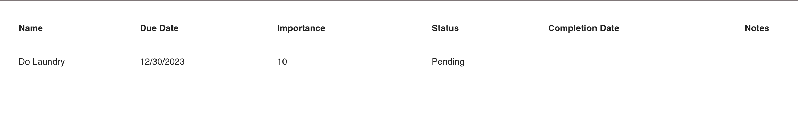
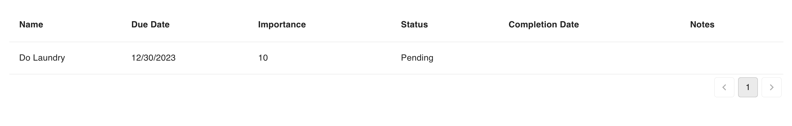
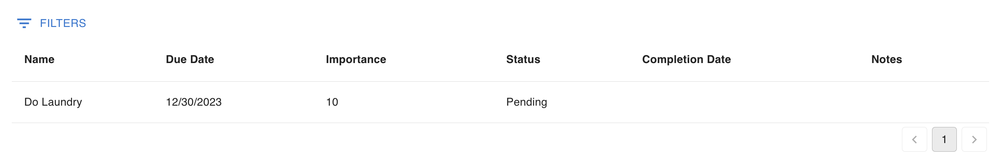

# hatchedReact.components

@hatchifyjs/react has several components available to use in your React app. There are two sets of components to be used.

The hatchifyReact Components are included in the HatchifyApp, and have access to the state from the provider.

- [DataGrid](#hatchify-datagrid)
- [Column](#hatchify-column)
- [Empty](#hatchify-empty)
- [List](#list)
- [Pagination](#pagination)
- [Filters](#filters)

## [Hatchify DataGrid](./components/hatchify-datagrid.md)

Similar to the MUI DataGrid, the Hatchify [`DataGrid`](./components/hatchify-datagrid.md) displays the records of a specific schema, without the [`DataGridState`](./types.md#datagridstate) needing to be passed in.

```tsx
//in App.tsx
const TodoDataGrid = hatchedReact.components.Todo.DataGrid // 👀

const App: React.FC = () => {
  return (
    <ThemeProvider theme={createTheme()}>
      <HatchifyProvider>
        <TodoDataGrid /> {/* 👀 */}
      </HatchifyProvider>
    </ThemeProvider>
  )
}
```

## [Hatchify Column](./components/hatchify-column.md)

The [`Column`](./components/hatchify-column.md) component is used anytime there is a need to customize the output of a specific column. This can be used as a child of both the Hatchify `DataGrid` and the MUI `DataGrid`. Learn more about custom components in [this guide](../guides/customizing-your-list.md).

```tsx
//in App.tsx
const TodoColumn = hatchedReact.components.Todo.DataGrid  // 👀

const App: React.FC = () => {
  return (
    <ThemeProvider theme={createTheme()}>
      <HatchifyProvider>
        <TodoDataGrid>
          <TodoDataGrid.Column {/* 👀 */}
            label="Todo"
            field="name"
          />
        </TodoDataGrid>
      </HatchifyProvider>
    </ThemeProvider>
  )
}
```

## [Hatchify Empty](./components//hatchify-empty.md)

[`Empty`](./components//hatchify-empty.md) is used to customize what is displayed when the Hatchify `DataGrid` has no records to display. Learn more about customizing `EmptyList` in [this guide](../guides/customizing-your-list.md).

```tsx
//in App.tsx
const TodoEmptyList = hatchedReact.components.Todo.Empty // 👀

const App: React.FC = () => {
  return (
    <ThemeProvider theme={createTheme()}>
      <HatchifyProvider>
        <TodoDataGrid>
          <TodoEmptyList>No records to display</TodoEmptyList> {/* 👀 */}
        </TodoDataGrid>
      </HatchifyProvider>
    </ThemeProvider>
  )
}
```

## List

`List` is used for displaying rows of records.

```tsx
//in App.tsx

const App: React.FC = () => {
  const todoState = hatchedReact.state.Todo.useDataGridState({
    include: ["user"],
  }) // 👀

  return (
    <ThemeProvider theme={createTheme()}>
      <HatchifyProvider>
        <List {...todoState}>
          {/* 👀 */}
          <TodoEmptyList>No records to display</TodoEmptyList>
        </List>
      </HatchifyProvider>
    </ThemeProvider>
  )
}
```



## Pagination

`Pagination` is used for paginating data in the table.

```tsx
//in App.tsx

const App: React.FC = () => {
  const todoState = hatchedReact.state.Todo.useDataGridState({
    include: ["user"],
  }) // 👀

  return (
    <ThemeProvider theme={createTheme()}>
      <HatchifyProvider>
        <List {...todoState}>
          {" "}
          {/* 👀 */}
          <TodoEmptyList>No records to display</TodoEmptyList>
        </List>
        <Pagination {...state} />
      </HatchifyProvider>
    </ThemeProvider>
  )
}
```



## Filters

`Filters` is used for filtering data in the table.

```tsx
//in App.tsx

const Filters = hatchedReact.components.Todo.Filters

const App: React.FC = () => {
  const todoState = hatchedReact.state.Todo.useDataGridState({
    include: ["user"],
  }) // 👀

  return (
    <ThemeProvider theme={createTheme()}>
      <HatchifyProvider>
        <Filters {...todoState} /> {/* 👀 */}
        <List {...todoState}>
          {" "}
          {/* 👀 */}
          <TodoEmptyList>No records to display</TodoEmptyList>
        </List>
        <Pagination {...todoState} />
      </HatchifyProvider>
    </ThemeProvider>
  )
}
```



