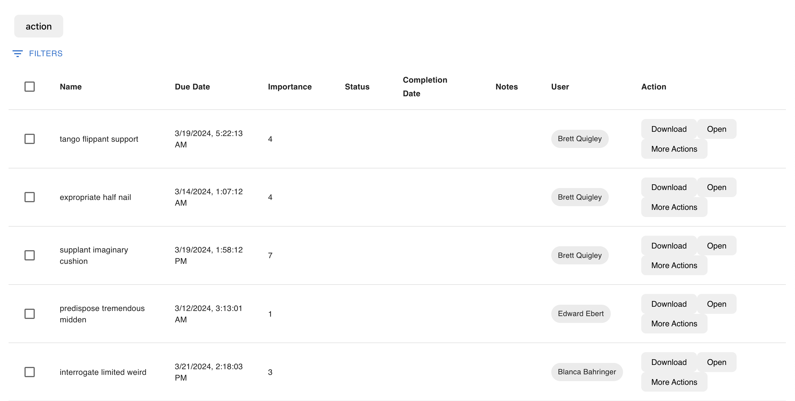

# hatchedReact.components[schemaName].DataGrid

Similar to the [MUI DataGrid](https://mui.com/x/react-data-grid/), the Hatchify `DataGrid` displays the records of a specific schema. It includes pagination, filtering and the ability to sort the grid.

The following image shows the DataGrid in action:



To produce something similar, use the following code:

```tsx
//in App.tsx
import { hatchifyReact, createJsonapiClient } from "@hatchifyjs/react"
import * as Schemas from "../schemas.js"

const hatchedReact = hatchifyReact(createJsonapiClient("/api", Schemas))

const TodoDataGrid = hatchedReact.components.Todo.DataGrid // 👀

const App: React.FC = () => {
  return (
    <ThemeProvider theme={createTheme()}>
      <HatchifyProvider>
        <TodoDataGrid
          defaultSelected={selected}
          defaultPage={{ number: 1, size: 5 }}
          defaultSort={{ direction: "asc", sortBy: "dueDate" }}
          baseFilter={[{field: "Name" operator: "$contains", value: "Walk"}]}
          overwrite
          minimumLoadTime={100}
        >
          <TodoDataGrid.Column label="Name" field="name" />
          <TodoDataGrid.Empty>There are no records available</TodoDataGrid.Empty>
        </TodoDataGrid>
      </HatchifyProvider>
    </ThemeProvider>
  )
}
```

- [Props](#props)
- [Prop Usage](#prop-usage)
  - [`children`](#children)
  - [`defaultSelected` & `onSelectedChange`](#defaultselected-and-onselectedchange)
  - [`defaultPage`](#defaultpage)
  - [`defaultSort`](#defaultsort)
  - [`baseFilter`](#basefilter)
  - [`overwrite`](#overwrite)
  - [`minimumLoadTime`](#minimumloadtime)

## Props

| Prop Name                                                   | Type                                                                        | Default | Description                                                                                                                                                                                                                                                                                                |
| ----------------------------------------------------------- | --------------------------------------------------------------------------- | ------- | ---------------------------------------------------------------------------------------------------------------------------------------------------------------------------------------------------------------------------------------------------------------------------------------------------------- |
| [`children`](#children)                                     | `React.ReactNode` or `null`                                                 | -       | While `DataGrid` can render without children, you can use hatchify's `Column` or `EmptyList` as children for this component.                                                                                                                                                                               |
| [`defaultSelected`](#defaultselected-and-onselectedchange)  | [`HatchifyDataGridSelectedState`](./types.md#hatchifydatagridselectedstate) | -       | `defaultSelected` adds a checkbox selection column to the `DataGrid` and a default selected value to the checked state. This checked state is managed by `onSelectedChange`                                                                                                                                |
| [`onSelectedChange`](#defaultselected-and-onselectedchange) | [`HatchifyDataGridSelectedState`](./types.md#hatchifydatagridselectedstate) | -       | `onSelectedChange` accepts a `setSelected` function to update the state of the props checked status.                                                                                                                                                                                                       |
| [`defaultPage`](#defaultpage)                               | [PaginationObject](./types.md#paginationobject)                             | -       | `defaultsPage` accepts a `number` and `size` property. `number` is the initial paginated position of the `DataGrid`. `size` controls the maximum number of rows shown on each page.                                                                                                                        |
| [`defaultSort`](#defaultsort)                               | [SortObject](./types.md#sortobject)                                         | -       | [`defaultSort`](#defaultsort) accepts a `direction` and `sortBy` property. `direction` can be `asc` for ascending order, or `desc` for descending order. `sortBy` accepts the the key of any of the `DataGrid` columns, such as 'Name' or 'dueDate'. If given a non-matching key no records will be found. |
| [`baseFilter`](#basefilter)                                 | [Filters](./types.md#filters)                                               | -       | [`baseFilter`](#basefilter) accepts an array of filter objects,[`FilterArray`](./types.md#filterarray), that contains `field`, the column to filter, `operator`, to determine the filter method, and `value`, the value being compared and filtered against the column data.                               |
| [`overwrite`](#overwrite)                                   | `boolean`                                                                   | -       | When `true`, only the `Column` children provided will render rather than the entire `DataGrid`.                                                                                                                                                                                                            |
| `alwaysSort`                                                | `boolean`                                                                   | `false` | When `true`, sorting a column will go between `asc` and `desc` rather than `asc`, `desc`, and `none`.                                                                                                                                                                                                      |

## Prop Usage

### `children`

The `DataGrid` can render without children, but typically you'll use hatchify's `DataGrid.Column` or `DataGrid.Empty` as children for this component.

```tsx
return (
  <DataGrid>
    <DataGrid.Column
      field="name"
      label="Name!"
      renderDataValue={({ record }) => {
        return <strong>{record.name}</strong>
      }}
    />
    <DataGrid.Empty>No todos found!</DataGrid.Empty>
  </DataGrid>
)
```

### `defaultSelected` and `onSelectedChange`

The `DataGrid` below will render with a checkbox selection column and a `Name` column. The `defaultSelected` prop sets the initial state of the checkbox selection column to `true` and the `onSelectedChange` prop will update the state and the checkbox selection column.

```tsx
const [selected, setSelected] = useState<{ all: boolean; ids: string[] }>({
  all: false,
  ids: [],
})

const App(){
  return (
    <HatchifyProvider>
      <TodoDataGrid
        defaultSelected={selected}
        onSelectedChange={setSelected}
      >
        <TodoDataGrid.Column
          label="Location"
          field="location"
          renderDataValue={({ record }) => {
            return <strong>{record.location}</strong>
          }} />
        <TodoDataGrid.Empty>There are no records available</TodoDataGrid.Empty>
      </TodoDataGrid>
    </ HatchifyProvider>
  )
}
```

### `defaultPage`

The below example will set the initial page position to 1 and the maximum number of rows shown on each page to 5.

```tsx
const App(){
  return (
    <HatchifyProvider>
      <TodoDataGrid
        number={1}
        size={5}
      >
        <TodoDataGrid.Column
          label="Location"
          field="location"
          renderDataValue={({ record }) => {
            return <strong>{record.location}</strong>
          }} />
        <TodoDataGrid.Empty>There are no records available</TodoDataGrid.Empty>
      </TodoDataGrid>
    </ HatchifyProvider>
  )
}
```

### `defaultSort`

The below example will set the initial sort direction to ascending and the column to sort by to `dueDate`.

```tsx
const App(){
  return (
    <HatchifyProvider>
      <TodoDataGrid
        direction="asc"
        sortBy="dueDate"
      >
        <TodoDataGrid.Column label="Due Date" field="dueDate" />
        <TodoDataGrid.Empty>There are no records available</TodoDataGrid.Empty>
      </TodoDataGrid>
    </ HatchifyProvider>
  )
}
```

### `baseFilter`

Sets a filter on the `DataGrid` that is immutable from the hatchify filter. The following `DataGrid` will show only records with an expiration date that contains "2023".

```tsx
const App = () =>{
  const value =
  return (
    <HatchifyProvider>
      <TodoDataGrid
        baseFilter={[{field: "expirationDate", operator: "$contains", value: "2023"}]}
      >
        <TodoDataGrid.Column label="First Name" field="first" />
        <TodoDataGrid.Column label="Last Name" field="last" />
        <TodoDataGrid.Column
          label="Expiration Date"
          field="expirationDate"
          renderDataValue={({ record }) => {
            return <strong style={{color: "red"}}>{record.expirationDate}</strong>
          }}>
        <TodoDataGrid.Empty>There are no records available</TodoDataGrid.Empty>
      </TodoDataGrid>
    </ HatchifyProvider>
  )
}
```

The potential `operators` for `baseFilter` can be found in the [`@hatchify/jsonapi implementation docs`](../jsonapi/reading/filtering/README.md).

### `overwrite`

The following example will only render the Age field column.

```tsx
const App = () =>{
  const value =
  return (
    <HatchifyProvider>
      <TodoDataGrid
        overwrite
      >
        <TodoDataGrid.Column label="Age" field="age" />
        <TodoDataGrid.Empty>There are no records available</TodoDataGrid.Empty>
      </TodoDataGrid>
    </ HatchifyProvider>
  )
}
```

### `minimumLoadTime`

```tsx
const App = () =>{
  const value =
  return (
    <HatchifyProvider>
      <TodoDataGrid
        minimumLoadTime={6000}
      >
        <TodoDataGrid.Column label="Age" field="age" />
        <TodoDataGrid.Empty>There are no records available</TodoDataGrid.Empty>
      </TodoDataGrid>
    </ HatchifyProvider>
  )
}
```
