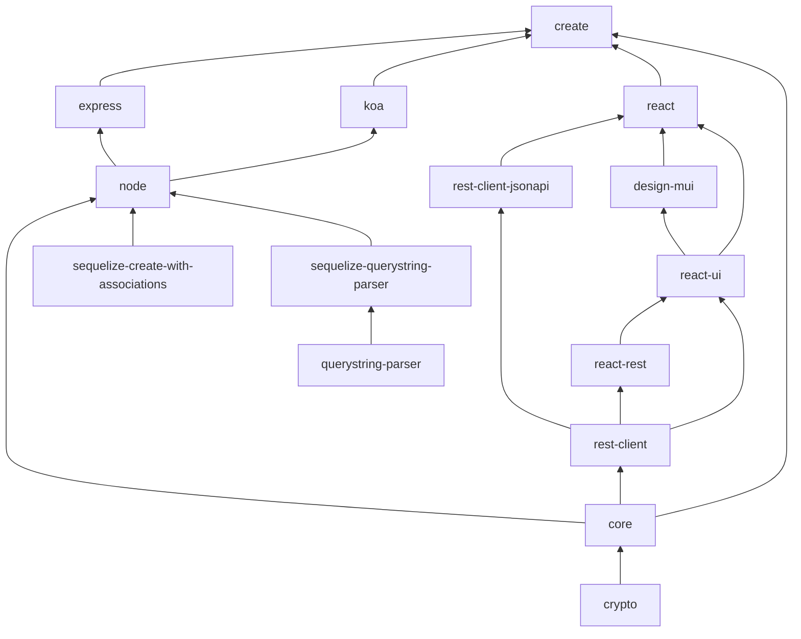

# Subpackages

Hatchify is built as a monorepo of multiple packages so you can choose which ones you want for your project.

## Packages

### [Core](../packages/core/README.md)

Hatchify's schemas and shared types.

### [Create](../packages/create/README.md)

Create a new Hatchify-based project.

### [Crypto](../packages/crypto/README.md) 🛑

Isomorphic WebCrypto package. Only Isomorphic. No Polyfills.

### [Design Material UI](../packages/design-mui/README.md) 🛑

Material UI implementation on of Hatchify's React components.

### [Express](../packages/express/README.md)

Middleware and helper functions to integrate Hatchify into an [Express](https://expressjs.com/) server. It is implemented as a tiny wrapped around the [Hatchify Node package](#node-).

### [Koa](../packages/koa/README.md)

Middleware and helper functions to integrate Hatchify into a [Koa](https://koajs.com/) server. It is implemented as a tiny wrapped around the [Hatchify Node package](#node-).

### [Node](../packages/node/README.md) 🛑

Middleware and helper functions to integrate Hatchify into any Node server.

### [Query String Parser](https://github.com/bitovi/querystring-parser)

Transforms CRUD-related query strings into structured data.

### [React](../packages/react/README.md)

Entry point for apps wanting Hatchify's React components and hooks.

### [React JSON:API](../packages/react-jsonapi/README.md)

Entry point for apps wanting Hatchify's data fetching.

### [React Rest](../packages/react-rest/README.md)

Adds React-specific data fetching (hooks) on top of the [Rest Client](#rest-client-) functions.

### [React UI](../packages/react-ui/README.md) 🛑

React components that tie together `design-*` components with [React Rest](#react-rest) data-fetching.

### [Rest Client](../packages/rest-client/README.md) 🛑

Data-fetching functions that are not framework-specific.

### [Rest Client JSON:API](../packages/rest-client-jsonapi/README.md) 🛑

Responsible for making network requests to a JSON:API-compliant backend.

### [Sequelize Create With Associations](https://github.com/bitovi/sequelize-create-with-associations)

A handy package that extends [Sequelize](https://sequelize.org/)'s to simplify the associations.

### [Sequelize Query String Parser](https://github.com/bitovi/querystring-parser)

This library builds on top of [Query String Parser](#query-string-parser) to transform CRUD-related query strings into structured data for the [Sequelize ORM](https://sequelize.org/).

## Package Dependencies

