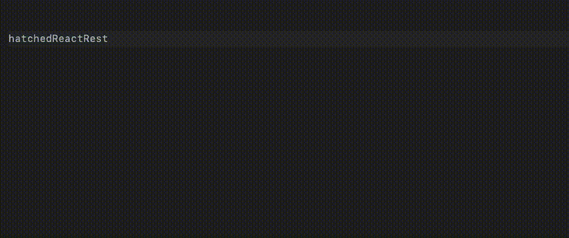
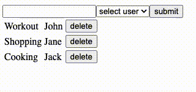
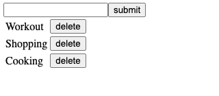
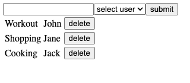

# react-rest

- [What is react-rest](#what-is-react-rest?)
  - [TypeScript](#typescript)
  - [Relationships](#relationships)
  - [Focus on UI](#focus-on-ui)
- [Building a Simple Todo App with react-rest](#building-a-simple-todo-app-with-react-rest)
  - [Project Setup](#project-setup)
  - [Listing, creating, and deleting todos](#listing-creating-and-deleting-todos)
    - [Configuration](#configuration)
      - [Schemas](#schemas)
      - [REST Client](#rest-client)
      - [hatchifyReactRest](#hatchifyreactrest)
    - [Fetching a list](#fetching-a-list)
    - [Creating](#creating)
    - [Deleting](#deleting)
  - [Relationships: Allowing a user to be assigned to todos](#relationships-allowing-a-user-to-be-assigned-to-todos)
    - [Fetching todos with related users](#fetching-todos-with-related-users)
    - [Fetching users and populating a select](#fetching-users-and-populating-a-select)
    - [Creating a todo with a user](#creating-a-todo-with-a-user)
- [Alternatives to hooks](#alternatives-to-hooks)

<a id="what-is-react-rest?"></a>

## What is react-rest?

React-rest is a model-driven library for interacting with your backend. By defining the schemas (AKA models) of your backend resources, react-rest will provide you with a set of hooks and functions that you can use across your React app.

<a id="typescript"></a>

### TypeScript

React-rest provides TypeScript support. Here's an example of how two schemas (`Todo` and `User`) provide auto-completion for an instantiated react-rest app (`hatchedReactRest`):



<a id="relationships"></a>

### Relationships

By providing react-rest your schemas, it will be able to fetch related data from your JSON:API backend.

> **Note:** take note of code commented with the 👀 emoji.

```tsx
const [todos] = hatchedReactRest.Todo.useAll({ include: ["user"] })

todos[0].name
todos[0].user.name // 👀
```

<a id="focus-on-ui"></a>

### Focus on UI

React-rest allows you to keep your focus on your UI. By defining your schemas ahead of time, you will not have to worry about your REST layer. Any changes you make to your data will trigger re-fetches in react-rest so that you’re always up to date.



<a id="building-a-simple-todo-app-with-react-rest"></a>

## Building a Simple Todo App with react-rest

The following guide creates a simple Todo app from scratch. At first, it will look like this:



Then, we'll extend the app to handle relationships:



<a id="project-setup"></a>

### Project Setup

> **Note:** the ✏️ icon indicates when to follow along!

**✏️ Perform the following steps:**

1. Ensure you’re using [node 18 and npm 9](https://nodejs.org/en/download).

   ```
   node -v
   ```

2. Create a new react app titled “react-rest-app” with Vite. TypeScript is recommended, but not required:

   ```
   npm create vite@latest react-rest-app -- --template react-ts
   ```

3. Move into the `/react-rest-app` directory and install the node modules:

   ```
   cd react-rest-app
   npm install
   ```

4. Install the `@hatchifyjs/react-rest` and `@hatchify-js/rest-client-jsonapi` libraries:

   ```
   npm install @hatchifyjs/react-rest @hatchifyjs/rest-client-jsonapi
   ```

5. For this guide, we’re going to use mock service worker as our backend.

   a. Install msw:

   ```
   npm install msw --save-dev
   ```

   b. Create a `/mocks` directory and initialize msw.

   ```
   mkdir src/mocks
   npx msw init public/ --save
   ```

   c. Run the following command to add a `browser.js` file to your `/mocks` directory and populate it with some request handlers and mocked data:

   ```
   curl -o src/mocks/browser.ts https://raw.githubusercontent.com/bitovi/hatchify/main/example/react-rest/src/mocks/browser.ts
   ```

6. To start the mock service worker, replace the contents of `src/main.tsx` with the following:

   ```tsx
   import React from "react"
   import ReactDOM from "react-dom/client"
   import App from "./App.tsx"

   // 👀
   if (process.env.NODE_ENV === "development") {
     await import("./mocks/browser").then(({ worker }) => {
       worker.start()
     })
   }

   ReactDOM.createRoot(document.getElementById("root") as HTMLElement).render(
     <React.StrictMode>
       <App />
     </React.StrictMode>,
   )
   ```

7. Run `npm run dev`, and open http://localhost:3000/ to see the starter app in action.


<a id="listing-creating-and-deleting-todos"></a>

### Listing, creating, and deleting todos

The following makes a simple todo app that loads todos from `/api/todos` and allows the user to create and delete todos.

**✏️ Replace the contents of `src/App.tsx` with the following:**

```tsx
// App.tsx
import { useState } from "react"
import type { Schema } from "@hatchifyjs/react-rest"
import hatchifyReactRest from "@hatchifyjs/react-rest"
import createClient from "@hatchifyjs/rest-client-jsonapi"

const Todo: Schema = {
  name: "Todo",
  displayAttribute: "name",
  attributes: {
    name: "string",
  },
}

const jsonapi = createClient("/api", { Todo })

const hatchedReactRest = hatchifyReactRest(jsonapi)

function App() {
  const [todos, todosMeta] = hatchedReactRest.Todo.useAll()
  const [createTodo, createState] = hatchedReactRest.Todo.useCreateOne()
  const [deleteTodo, deleteState] = hatchedReactRest.Todo.useDeleteOne()
  const [todoName, setTodoName] = useState("")

  if (todosMeta.isPending) {
    return <div>loading...</div>
  }

  return (
    <div>
      <div>
        <input type="text" value={todoName} onChange={(e) => setTodoName(e.target.value)} />
        <button
          disabled={createState.isPending}
          type="button"
          onClick={() => {
            createTodo({ attributes: { name: todoName } })
            setTodoName("")
          }}
        >
          {createState.isPending ? "submitting..." : "submit"}
        </button>
      </div>
      <table>
        <thead>
          {todos.map((todo) => (
            <tr key={todo.id}>
              <td>{todo.name}</td>
              <td>
                <button disabled={deleteState.isPending} type="button" onClick={() => deleteTodo(todo.id)}>
                  delete
                </button>
              </td>
            </tr>
          ))}
        </thead>
      </table>
    </div>
  )
}

export default App
```

**✏️ Make sure to save the file. Your browser should automatically update with the changes.**

In the following sections, we'll configure react-rest to understand the data it’s loading, where it’s loading it from, and that it’s using a JSON:API data format.

> **Note:** In your Vite app, you may have noticed the duplicated GET requests in the network tab. This is happening because Vite runs React in strict mode in development. In strict mode, React is running hooks twice (hence the duplicated requests) to help catch bugs in our code. You can read more about it [here](https://react.dev/reference/react/StrictMode).

<a id="configuration"></a>

#### Configuration

<a id="schemas"></a>

##### Schemas

React-rest is powered by **schema-driven development**. A schema is an object representation of our backend resources. React-rest provides a `Schema` type that we can follow to make sure our objects are defined correctly. In our App.tsx we have created a `Todo` schema, and on it we defined the following:

- The name of our schema, `Todo`

- The primary display attribute, in this case `name`

- An object containing all the attributes of our Todo, currently only `name`

```tsx
// App.tsx
import type { Schema } from "@hatchifyjs/react-rest"

// ...

const Todo: Schema = {
  name: "Todo",
  displayAttribute: "name",
  attributes: {
    name: "string",
  },
}
```

<a id="rest-client"></a>

##### REST Client

React-rest expects a client to be passed into it. HatchifyJS provides a JSON:API rest client to use which takes in a base URL, and a mapping of schemas to endpoints. The response from the `createClient` call is what we will pass into our react-rest app.

```tsx
// App.tsx
import createClient from "@hatchifyjs/rest-client-jsonapi"

// ...

const jsonapi = createClient("/api", { Todo })
```

<a id="hatchifyreactrest"></a>

##### hatchifyReactRest

```tsx
// App.tsx
import hatchifyReactRest from "@hatchifyjs/react-rest"

// ...

const hatchedReactRest = hatchifyReactRest(jsonapi)
```

<a id="fetching-a-list"></a>

#### Fetching a list

To fetch a list of todos we are using the `useAll` hook from react-rest inside of our `App.tsx`. The object returned from `hatchifyReactRest` will contain a key for each schema passed into it. Off of that key we can call the `useAll` hook which will fetch us a list of todos. Any time a user mutates a todo (by creating, updating, or deleting), our `useAll` hook will re-fetch the latest data.

The return from `useAll` is an array where the first index contains an array of todos and the second index contains any metadata about our request, such as whether we’re fetching data or if we received an error.

```tsx
// App.tsx: App component
// 👀
const [todos, todosMeta] = hatchedReactRest.Todo.useAll()

// 👀
if (todosMeta.isPending) {
  return <div>loading...</div>
}

// 👀
return (
  <table>
    <thead>
      {todos.map((todo) => (
        <tr key={todo.id}>
          <td>{todo.name}</td>
        </tr>
      ))}
    </thead>
  </table>
)
```

> **Note:** You might be unfamiliar with calling a hook as a method on an object (like we're doing above) but it's perfectly valid! A hook is a hook, and it still follows the rules of hooks, even when it's a method.

<a id="creating"></a>

#### Creating

To create new todos we are using the `useCreateOne` hook from react-rest. The `useCreateOne` hook returns an array with 3 values. The first index returns a mutate function, which is what we use to create a todo. The second index, similar to `useAll`, contains metadata about our create request. Finally, the third index contains the latest created todo; which in this example we can safely ignore.

```tsx
// App.tsx: App component
const [todos, todosMeta] = hatchedReactRest.Todo.useAll()
// 👀
const [createTodo, createState] = hatchedReactRest.Todo.useCreateOne()
const [todoName, setTodoName] = useState("")

// 👀
if (todosMeta.isPending) {
  return <div>loading...</div>
}

// 👀
return (
  <div>
    <div>
      {/* 👀 */}
      <input type="text" value={todoName} onChange={(e) => setTodoName(e.target.value)} />
      {/* 👀 */}
      <button disabled={createState.isPending} type="button" onClick={() => createTodo({ attributes: { name: todoName } })}>
        {createState.isPending ? "submitting..." : "submit"}
      </button>
    </div>
    <table>
      <thead>
        {todos.map((todo) => (
          <tr key={todo.id}>
            <td>{todo.name}</td>
          </tr>
        ))}
      </thead>
    </table>
  </div>
)
```

<a id="deleting"></a>

#### Deleting

For deleting todos, our `App.tsx` is using `useDeleteOne`. This hook behaves similarly to `useCreateOne`: the first index contains the delete function and the second contains metadata about our delete request. This hook does not return a third index as `useCreateOne` does.

```tsx
// App.tsx: App component
const [todos, todosMeta] = hatchedReactRest.Todo.useAll()
const [createTodo, createState] = hatchedReactRest.Todo.useCreateOne()
// 👀
const [deleteTodo, deleteState] = hatchedReactRest.Todo.useDeleteOne()
const [todoName, setTodoName] = useState("")

if (todosMeta.isPending) {
  return <div>loading...</div>
}

return (
  <div>
    <div>
      <input type="text" value={todoName} onChange={(e) => setTodoName(e.target.value)} />
      <button disabled={createState.isPending} type="button" onClick={() => createTodo({ attributes: { name: todoName } })}>
        {createState.isPending ? "submitting..." : "submit"}
      </button>
    </div>
    <table>
      <thead>
        {todos.map((todo) => (
          <tr key={todo.id}>
            <td>{todo.name}</td>
            {/* 👀 */}
            <td>
              <button disabled={deleteState.isPending} type="button" onClick={() => deleteTodo(todo.id)}>
                delete
              </button>
            </td>
          </tr>
        ))}
      </thead>
    </table>
  </div>
)
```

<a id="relationships-allowing-a-user-to-be-assigned-to-todos"></a>

### Relationships: Allowing a user to be assigned to todos

If we define many schemas and the relationships between them, then we can fetch the related records using the hooks and functions provided by react-rest.

<a id="fetching-todos-with-related-users"></a>

#### Fetching todos with related users

To fetch todos with their related users, we need to make a few changes to our `App.tsx`.

First, we need to update our Todo schema to have a relationship to a user and then create a new User schema.

**✏️ Modify the Todo schema to have a relationships property:**

```ts
// App.tsx
const Todo: Schema = {
  name: "Todo",
  displayAttribute: "name",
  attributes: {
    name: "string",
  },
  // 👀
  relationships: {
    user: {
      type: "one",
      schema: "User",
    },
  },
}
```

**✏️ Create a new User schema:**

```ts
// App.tsx
// 👀
const User: Schema = {
  name: "User",
  displayAttribute: "name",
  attributes: {
    name: "string",
  },
  relationships: {
    todos: {
      type: "many",
      schema: "Todo",
    },
  },
}
```

Next, we need to pass the new User schema into `createClient` and `hatchifyReactRest`.

**✏️ Pass the new schema into `createClient` and `hatchifyReactRest`:**

```ts
// App.tsx
const jsonapi = createClient("/api", {
  Todo,
  // 👀
  User,
})

const hatchedReactRest = hatchifyReactRest(jsonapi)
```

Finally, we update our `useAll` hook to include user data and update our list to print a user name for each todo.

**✏️ Update the `useAll` hook to include user data:**

```tsx
// App.tsx: App component
const [todos, todosMeta] = hatchedReactRest.Todo.useAll({ include: ["user"] }) // 👀
```

**✏️ Update the list to print a user name for each todo:**

```tsx
// App.tsx: App component
{
  todos.map((todo) => (
    <tr key={todo.id}>
      <td>{todo.name}</td>
      {/* 👀 */}
      <td>{todo.user?.name}</td>
      <td>
        <button disabled={deleteState.isPending} type="button" onClick={() => deleteTodo(todo.id)}>
          delete
        </button>
      </td>
    </tr>
  ))
}
```

Your `App.tsx` should now look like this:

```tsx
// App.tsx
import { useState } from "react"
import type { Schema } from "@hatchifyjs/react-rest"
import hatchifyReactRest from "@hatchifyjs/react-rest"
import createClient from "@hatchifyjs/rest-client-jsonapi"

const Todo: Schema = {
  name: "Todo",
  displayAttribute: "name",
  attributes: {
    name: "string",
  },
  relationships: {
    user: {
      type: "one",
      schema: "User",
    },
  },
}

const User: Schema = {
  name: "User",
  displayAttribute: "name",
  attributes: {
    name: "string",
  },
  relationships: {
    todos: {
      type: "many",
      schema: "Todo",
    },
  },
}

const jsonapi = createClient("/api", { Todo, User })

const hatchedReactRest = hatchifyReactRest(jsonapi)

function App() {
  const [todos, todosMeta] = hatchedReactRest.Todo.useAll({ include: ["user"] })
  const [createTodo, createState] = hatchedReactRest.Todo.useCreateOne()
  const [deleteTodo, deleteState] = hatchedReactRest.Todo.useDeleteOne()
  const [todoName, setTodoName] = useState("")

  if (todosMeta.isPending) {
    return <div>loading...</div>
  }

  return (
    <div>
      <div>
        <input type="text" value={todoName} onChange={(e) => setTodoName(e.target.value)} />
        <button
          disabled={createState.isPending}
          type="button"
          onClick={() => {
            createTodo({ attributes: { name: todoName } })
            setTodoName("")
          }}
        >
          {createState.isPending ? "submitting..." : "submit"}
        </button>
      </div>
      <table>
        <thead>
          {todos.map((todo) => (
            <tr key={todo.id}>
              <td>{todo.name}</td>
              <td>{todo.user?.name}</td>
              <td>
                <button disabled={deleteState.isPending} type="button" onClick={() => deleteTodo(todo.id)}>
                  delete
                </button>
              </td>
            </tr>
          ))}
        </thead>
      </table>
    </div>
  )
}

export default App
```

And your app should now look like this:


<a id="fetching-users-and-populating-a-select"></a>

#### Fetching users and populating a select

Now that we've added the User schema into our `createClient` and `hatchifyReactRest`, we can fetch users and populate a select with them.

**✏️ Add a new `useAll` hook to fetch users:**

```tsx
// App.tsx: App component
const [users, usersMeta] = hatchedReactRest.User.useAll()
```

**✏️ Add a stateful select input that has users as options:**

```tsx
// App.tsx: App component
const [selectedUser, setSelectedUser] = useState("")
```

```tsx
// App.tsx: App component
<input
  type="text"
  value={todoName}
  onChange={(e) => setTodoName(e.target.value)}
/>
{/* 👀 */}
<select
  disabled={usersMeta.isPending}
  value={selectedUser}
  onChange={(e) => setSelectedUser(e.target.value)}
>
  <option value="">select user</option>
  {users.map((user) => (
    <option key={user.id} value={user.id}>
      {user.name}
    </option>
  ))}
</select>
<button
  disabled={createState.isPending}
  type="button"
  onClick={() => {
    createTodo({
      attributes: { name: todoName },
    })
    setTodoName("")
  }}
>
  {createState.isPending ? "submitting..." : "submit"}
</button>
```

<a id="creating-a-todo-with-a-user"></a>

#### Creating a todo with a user

Now that we have a `select` populated with users, we can create a todo with a user.

**✏️ Update `createTodo` to pass in the selected user id and set the selectedUser back to its default state:**

```tsx
// App.tsx: App component
<button
  disabled={createState.isPending}
  type="button"
  onClick={() => {
    createTodo({
      attributes: { name: todoName },
      // 👀
      relationships: { user: { id: selectedUser } },
    })
    setTodoName("")
    // 👀
    setSelectedUser("")
  }}
>
  {createState.isPending ? "submitting..." : "submit"}
</button>
```

**Altogether, our App.tsx should look like this:**

```tsx
// App.tsx
import { useState } from "react"
import type { Schema } from "@hatchifyjs/react-rest"
import hatchifyReactRest from "@hatchifyjs/react-rest"
import createClient from "@hatchifyjs/rest-client-jsonapi"

const Todo: Schema = {
  name: "Todo",
  displayAttribute: "name",
  attributes: {
    name: "string",
  },
  relationships: {
    user: {
      type: "one",
      schema: "User",
    },
  },
}

const User: Schema = {
  name: "User",
  displayAttribute: "name",
  attributes: {
    name: "string",
  },
  relationships: {
    todos: {
      type: "many",
      schema: "Todo",
    },
  },
}

const jsonapi = createClient("/api", { Todo, User })

const hatchedReactRest = hatchifyReactRest(jsonapi)

function App() {
  const [todos, todosMeta] = hatchedReactRest.Todo.useAll({ include: ["user"] })
  const [createTodo, createState] = hatchedReactRest.Todo.useCreateOne()
  const [deleteTodo, deleteState] = hatchedReactRest.Todo.useDeleteOne()
  const [todoName, setTodoName] = useState("")

  const [users, usersMeta] = hatchedReactRest.User.useAll()
  const [selectedUser, setSelectedUser] = useState("")

  if (todosMeta.isPending) {
    return <div>loading...</div>
  }

  return (
    <div>
      <div>
        <input type="text" value={todoName} onChange={(e) => setTodoName(e.target.value)} />
        <select disabled={usersMeta.isPending} value={selectedUser} onChange={(e) => setSelectedUser(e.target.value)}>
          <option value="">select user</option>
          {users.map((user) => (
            <option key={user.id} value={user.id}>
              {user.name}
            </option>
          ))}
        </select>
        <button
          disabled={createState.isPending}
          type="button"
          onClick={() => {
            createTodo({
              attributes: { name: todoName },
              relationships: { user: { id: selectedUser } },
            })
            setTodoName("")
            setSelectedUser("")
          }}
        >
          {createState.isPending ? "submitting..." : "submit"}
        </button>
      </div>
      <table>
        <thead>
          {todos.map((todo) => (
            <tr key={todo.id}>
              <td>{todo.name}</td>
              <td>{todo.user?.name}</td>
              <td>
                <button disabled={deleteState.isPending} type="button" onClick={() => deleteTodo(todo.id)}>
                  delete
                </button>
              </td>
            </tr>
          ))}
        </thead>
      </table>
    </div>
  )
}

export default App
```

Congratulations! You've just created an app with react-rest with a fully functional development backend, complete with CRUD operations and relationship support.

> **Note:** At this point we've reached the limits of what our todo app's `msw`-powered API supports. If you would like to continue exploring the HatchifyJS ecosystem, then we suggest setting up a standalone HatchifyJS backend. The getting started guide for a HatchifyJS backend can be found [here](https://github.com/bitovi/hatchify/blob/main/packages/koa/README.md).

For more information on react-rest, read on.

<a id="alternatives-to-hooks"></a>

## Alternatives to hooks

Sometimes we need to fetch data outside of our React components. For these cases, react-rest provides us with promise-based equivalents.

| hooks        | promises  |
| ------------ | --------- |
| useCreateOne | createOne |
| useUpdateOne | updateOne |
| useDeleteOne | deleteOne |
| useAll       | findAll   |
| useOne       | findOne   |
