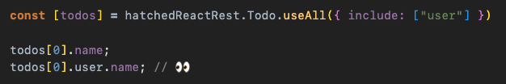

# react-rest

- [What is react-rest](#what-is-react-rest?)
  - [TypeScript](#typescript)
  - [Relationships](#relationships)
  - [Focus on UI](#focus-on-ui)
- [Building a Simple Todo App with react-rest](#building-a-simple-todo-app-with-react-rest)
  - [Project Setup](#project-setup)
  - [Listing, creating, and deleting todos](#listing-creating-and-deleting-todos)
    - [Configuration](#configuration)
      - [Schemas](#schemas)
      - [REST Client](#rest-client)
      - [hatchifyReactRest](#hatchifyreactrest)
    - [Fetching a list](#fetching-a-list)
    - [Creating](#creating)
    - [Deleting](#deleting)
  - [Relationships: Allowing a user to be assigned to todos](#relationships-allowing-a-user-to-be-assigned-to-todos)
    - [Fetching todos with related users](#fetching-todos-with-related-users)
    - [Fetching users and populating a select](#fetching-users-and-populating-a-select)
    - [Creating a todo with a user](#creating-a-todo-with-a-user)
- [Alternatives to hooks](#alternatives-to-hooks)

Unlike code generation tools which allow you to write your schema and then generate your code, once you start making customizations you can't re-run the generator without losing your customization HatchifyJS enables you to make changes to your database schema and customize app behavior **independently**. This is because HatchifyJS is **not** code generation—it's a system of modular and hierarchical libraries that can be consumed piecemeal to use as much or as little of HatchifyJS abilities as you require.

<a id="what-is-react-rest?"></a>

## What is react-rest?

react-rest is a model-driven library for interacting with your backend. By defining the schemas (aka models) of your backend resources, react-rest will provide you with a set of hooks and functions that you can use across your React app.

<a id="typescript"></a>

### TypeScript


<a id="relationships"></a>

### Relationships

By providing react-rest your schemas, it will be able to fetch related data from your JSON:API backend.



<a id="focus-on-ui"></a>

### Focus on UI

react-rest allows you to keep your focus on your UI. By defining your schemas ahead of time, you will not have to worry about your REST layer. Any changes you make to your data will trigger re-fetches in react-rest so that you’re always up to date.


<a id="building-a-simple-todo-app-with-react-rest"></a>

## Building a Simple Todo App with react-rest

The following guide creates a simple Todo app from scratch.


Then we extend the app with relationships.


<a id="project-setup"></a>

### Project Setup

**✏️ Perform all the following steps:**

1. Ensure you’re using [node 18 and npm 9](https://nodejs.org/en/download).

   ```
   node -v
   ```

2. Create a new react app titled “react-rest-app” with Vite. TypeScript is recommended, but not required:

   ```
   npm create vite@latest react-rest-app -- --template react-ts
   ```

3. Move into the “react-rest-app” directory and install the node modules:

   ```
   cd react-rest-app
   npm install
   ```

4. Install the `@hatchifyjs/react-rest` and `@hatchify-js/rest-client-jsonapi` libraries:

   ```
   npm install @hatchifyjs/react-rest @hatchifyjs/rest-client-jsonapi
   ```

5. For this guide, we’re going to use mock service worker as our backend.

   a. Install msw:

   ```
   npm install msw --save-dev
   ```

   b. Create a mocks directory and add a `browser.js` to it:

   ```
   mkdir src/mocks
   npx msw init public/ --save
   ```

   c. Run the following command to copy the mocked data into your repo:

   ```
   curl -o src/mocks/browser.ts https://raw.githubusercontent.com/bitovi/hatchify/main/example/react-rest/src/mocks/browser.ts
   ```

6. Update src/main.tsx to start the mock service worker:

   ```tsx
   import React from "react"
   import ReactDOM from "react-dom/client"
   import App from "./App.tsx"

   // 👀
   if (process.env.NODE_ENV === "development") {
     await import("./mocks/browser").then(({ worker }) => {
       worker.start()
     })
   }

   ReactDOM.createRoot(document.getElementById("root") as HTMLElement).render(
     <React.StrictMode>
       <App />
     </React.StrictMode>,
   )
   ```

7. Run `npm run dev`, and open http://localhost:5173/ to see the starter app in action.


<a id="listing-creating-and-deleting-todos"></a>

### Listing, creating, and deleting todos

The following makes a simple todo app that loads todos from `/api/todos` and allows the user to create and delete todos.

**✏️ Copy the following code into your `src/App.tsx`:**

```tsx
// App.tsx
import { useState } from "react"
import type { Schema } from "@hatchifyjs/react-rest"
import hatchifyReactRest from "@hatchifyjs/react-rest"
import createClient from "@hatchifyjs/rest-client-jsonapi"

const Todo: Schema = {
  name: "Todo",
  displayAttribute: "name",
  attributes: {
    name: "string",
  },
}

const jsonapi = createClient("/api", {
  Todo: { endpoint: "todos" },
})

const hatchedReactRest = hatchifyReactRest({ Todo }, jsonapi)

function App() {
  const [todos, listState] = hatchedReactRest.Todo.useAll()
  const [createTodo, createState] = hatchedReactRest.Todo.useCreateOne()
  const [deleteTodo, deleteState] = hatchedReactRest.Todo.useDeleteOne()
  const [todoName, setTodoName] = useState("")

  if (listState.isLoading) {
    return <div>loading...</div>
  }

  return (
    <div>
      <div>
        <input type="text" value={todoName} onChange={(e) => setTodoName(e.target.value)} />
        <button
          disabled={createState.isLoading}
          type="button"
          onClick={() => {
            createTodo({ attributes: { name: todoName } })
            setTodoName("")
          }}
        >
          {createState.isLoading ? "submitting..." : "submit"}
        </button>
      </div>
      <table>
        <thead>
          {todos.map((todo) => (
            <tr key={todo.id}>
              <td>{todo.name}</td>
              <td>
                <button disabled={deleteState.isLoading} type="button" onClick={() => deleteTodo(todo.id)}>
                  delete
                </button>
              </td>
            </tr>
          ))}
        </thead>
      </table>
    </div>
  )
}

export default App
```

**✏️ Make sure to save the file and your browser should be automatically updated with the changes.**

Let's see how each part works. First, we need to configure react-rest to understand the data it’s loading, where it’s loading it from, and that it’s using a JSONAPI data format.

> **Note**
> If you noticed the duplicated GET requests in the network tab, this is because React is running in strict mode in development. In strict mode, React is running hooks twice to help catch bugs in our code. You can read more about it [here](https://react.dev/reference/react/StrictMode).

<a id="configuration"></a>

#### Configuration

<a id="schemas"></a>

##### Schemas

react-rest is powered by **schema-driven development**. A schema is an object representation of our backend resources. react-rest provides a Schema type that we can follow to make sure our objects are defined correctly. In our App.tsx we have created a Todo schema and on it we defined the following:

- the name of our schema, “Todo”

- the primary display attribute, in this case “name”

- an object containing all the attributes of our Todo, currently only “name”

```tsx
// App.tsx
import type { Schema } from "@hatchifyjs/react-rest"

// ...

const Todo: Schema = {
  name: "Todo",
  displayAttribute: "name",
  attributes: {
    name: "string",
  },
}
```

<a id="rest-client"></a>

##### REST Client

react-rest expects a client to be passed into it. HatchifyJS provides a JSON:API rest client to use which takes in a baseURL, and a mapping of schemas to endpoints. The response from the createClient call is what we will pass into our react-rest app.

```tsx
// App.tsx
import createClient from "@hatchifyjs/rest-client-jsonapi"

// ...

const jsonapi = createClient("/api", {
  Todo: { endpoint: "todos" },
})
```

<a id="hatchifyreactrest"></a>

##### hatchifyReactRest

```tsx
// App.tsx
import hatchifyReactRest from "@hatchifyjs/react-rest"

// ...

const hatchedReactRest = hatchifyReactRest({ Todo }, jsonapi)
```

<a id="fetching-a-list"></a>

#### Fetching a list

To fetch a list of todos we are using the `useAll` hook from react-rest inside of our `App.tsx`. The object returned from `hatchifyReactRest` will contain a key for each schema passed into it. Off of that key we can pull the `useAll` hook which will fetch us a list of todos. Any time a user mutates a todo (by creating, updating, or deleting) then our `useAll` hook will re-fetch the latest data.

The return from `useAll` is an array where the first index contains an array of todos and the second index contains any metadata about our request, such as whether we’re fetching data or if we received an error.

```tsx
// App.tsx: App component
// 👀
const [todos, listState] = hatchedReactRest.Todo.useAll()

// 👀
if (listState.isLoading) {
  return <div>loading...</div>
}

// 👀
return (
  <table>
    <thead>
      {todos.map((todo) => (
        <tr key={todo.id}>
          <td>{todo.name}</td>
        </tr>
      ))}
    </thead>
  </table>
)
```

<a id="creating"></a>

#### Creating

To create new todos we are using the `useCreateOne` hook from react-rest. The `useCreateOne` hook returns an array with 3 values. The first index returns a mutate function, this is what we use to create a todo. The second index, similar to `useAll`, contains meta data about our create request. Finally, the third index contains the latest created todo; which in this example we can safely ignore.

```tsx
// App.tsx: App component
const [todos, listState] = hatchedReactRest.Todo.useAll()
// 👀
const [createTodo, createState] = hatchedReactRest.Todo.useCreateOne()
const [todoName, setTodoName] = useState("")

// 👀
if (listState.isLoading) {
  return <div>loading...</div>
}

// 👀
return (
  <div>
    <div>
      {/* 👀 */}
      <input type="text" value={todoName} onChange={(e) => setTodoName(e.target.value)} />
      {/* 👀 */}
      <button disabled={createState.isLoading} type="button" onClick={() => createTodo({ attributes: { name: todoName } })}>
        {createState.isLoading ? "submitting..." : "submit"}
      </button>
    </div>
    <table>
      <thead>
        {todos.map((todo) => (
          <tr key={todo.id}>
            <td>{todo.name}</td>
          </tr>
        ))}
      </thead>
    </table>
  </div>
)
```

<a id="deleting"></a>

#### Deleting

For deleting todos, our `App.tsx` is using `useDeleteOne`. This hook behaves similarly to `useCreateOne`: the first index contains the delete function and the second contains meta data about our delete request. The delete hook does not return a third index as it does with create.

```tsx
// App.tsx: App component
const [todos, listState] = hatchedReactRest.Todo.useAll()
const [createTodo, createState] = hatchedReactRest.Todo.useCreateOne()
// 👀
const [deleteTodo, deleteState] = hatchedReactRest.Todo.useDeleteOne()
const [todoName, setTodoName] = useState("")

if (listState.isLoading) {
  return <div>loading...</div>
}

return (
  <div>
    <div>
      <input type="text" value={todoName} onChange={(e) => setTodoName(e.target.value)} />
      <button disabled={createState.isLoading} type="button" onClick={() => createTodo({ attributes: { name: todoName } })}>
        {createState.isLoading ? "submitting..." : "submit"}
      </button>
    </div>
    <table>
      <thead>
        {todos.map((todo) => (
          <tr key={todo.id}>
            <td>{todo.name}</td>
            {/* 👀 */}
            <td>
              <button disabled={deleteState.isLoading} type="button" onClick={() => deleteTodo(todo.id)}>
                delete
              </button>
            </td>
          </tr>
        ))}
      </thead>
    </table>
  </div>
)
```

<a id="relationships-allowing-a-user-to-be-assigned-to-todos"></a>

### Relationships: Allowing a user to be assigned to todos

If we define many schemas and the relationships between them, then we can fetch the related records using the hooks and functions provided by react-rest.

<a id="fetching-todos-with-related-users"></a>

#### Fetching todos with related users

To fetch todos with their related users, we need to make a few changes to our `App.tsx`. First, we need to update our Todo schema to have a relationship to a user and then create a new User schema. Then we need to pass the new Userschema into `createClient` and `hatchifyReactRest`. Finally, we update our `useAll` hook to include user data and update our list to print a user name for each todo.

**✏️ Modify the Todo schema to have a relationships property:**

```ts
// App.tsx
const Todo: Schema = {
  name: "Todo",
  displayAttribute: "name",
  attributes: {
    name: "string",
  },
  // 👀
  relationships: {
    user: {
      type: "one",
      schema: "User",
    },
  },
}
```

**✏️ Create a new User schema:**

```ts
// App.tsx
// 👀
const User: Schema = {
  name: "User",
  displayAttribute: "name",
  attributes: {
    name: "string",
  },
  relationships: {
    todos: {
      type: "many",
      schema: "Todo",
    },
  },
}
```

**✏️ Pass the new schema into `createClient` and `hatchifyReactRest`:**

```ts
// App.tsx
const jsonapi = createClient("/api", {
  Todo: { endpoint: "todos" },
  // 👀
  User: { endpoint: "users" },
})

// 👀
const hatchedReactRest = hatchifyReactRest({ Todo, User }, jsonapi)
```

**✏️ Update the `useAll` hook to include user data:**

```tsx
// App.tsx: App component
const [todos, listState] = hatchedReactRest.Todo.useAll({ include: ["user"] }) // 👀
```

**✏️ Update the list to print a user name for each todo:**

```tsx
// App.tsx: App component
{
  todos.map((todo) => (
    <tr key={todo.id}>
      <td>{todo.name}</td>
      {/* 👀 */}
      <td>{todo.user?.name}</td>
      <td>
        <button disabled={deleteState.isLoading} type="button" onClick={() => deleteTodo(todo.id)}>
          delete
        </button>
      </td>
    </tr>
  ))
}
```

<a id="fetching-users-and-populating-a-select"></a>

#### Fetching users and populating a select

Now that we've added the User schema into our `createClient` and `hatchifyReactRest`, we can fetch users and populate a select with them.

**✏️ Add a new `useAll` hook to fetch users:**

```tsx
// App.tsx: App component
const [users, usersState] = hatchedReactRest.User.useAll()
```

**✏️ Add a stateful select input that has users as options:**

```tsx
// App.tsx: App component
const [selectedUser, setSelectedUser] = useState("")
```

```tsx
// App.tsx: App component
<input
  type="text"
  value={todoName}
  onChange={(e) => setTodoName(e.target.value)}
/>
{/* 👀 */}
<select
  disabled={usersState.isLoading}
  value={selectedUser}
  onChange={(e) => setSelectedUser(e.target.value)}
>
  <option value="">select user</option>
  {users.map((user) => (
    <option key={user.id} value={user.id}>
      {user.name}
    </option>
  ))}
</select>
<button
  disabled={createState.isLoading}
  type="button"
  onClick={() => {
    createTodo({
      attributes: { name: todoName },
    })
    setTodoName("")
  }}
>
  {createState.isLoading ? "submitting..." : "submit"}
</button>
```

<a id="creating-a-todo-with-a-user"></a>

#### Creating a todo with a user

Now that we have a select populated with users, we can create a todo with a user.

**✏️ Update `createTodo` to pass in the selected user id:**

```tsx
// App.tsx: App component
<input
  type="text"
  value={todoName}
  onChange={(e) => setTodoName(e.target.value)}
/>
<select
  disabled={usersState.isLoading}
  value={selectedUser}
  onChange={(e) => setSelectedUser(e.target.value)}
>
  <option value="">select user</option>
  {users.map((user) => (
    <option key={user.id} value={user.id}>
      {user.name}
    </option>
  ))}
</select>
<button
  disabled={createState.isLoading}
  type="button"
  onClick={() => {
    createTodo({
      attributes: { name: todoName },
      // 👀
      relationships: { user: { id: selectedUser } },
    })
    setTodoName("")
    // 👀
    setSelectedUser("")
  }}
>
  {createState.isLoading ? "submitting..." : "submit"}
</button>
```

**👀 Altogether, our App.tsx should look like this:**

```tsx
// App.tsx
import { useState } from "react"
import type { Schema } from "@hatchifyjs/react-rest"
import hatchifyReactRest from "@hatchifyjs/react-rest"
import createClient from "@hatchifyjs/rest-client-jsonapi"

const Todo: Schema = {
  name: "Todo",
  displayAttribute: "name",
  attributes: {
    name: "string",
  },
  relationships: {
    user: {
      type: "one",
      schema: "User",
    },
  },
}

const User: Schema = {
  name: "User",
  displayAttribute: "name",
  attributes: {
    name: "string",
  },
  relationships: {
    todos: {
      type: "many",
      schema: "Todo",
    },
  },
}

const jsonapi = createClient("/api", {
  Todo: { endpoint: "todos" },
  User: { endpoint: "users" },
})

const hatchedReactRest = hatchifyReactRest({ Todo, User }, jsonapi)

function App() {
  const [todos, listState] = hatchedReactRest.Todo.useAll({ include: ["user"] })
  const [createTodo, createState] = hatchedReactRest.Todo.useCreateOne()
  const [deleteTodo, deleteState] = hatchedReactRest.Todo.useDeleteOne()
  const [todoName, setTodoName] = useState("")

  const [users, usersState] = hatchedReactRest.User.useAll()
  const [selectedUser, setSelectedUser] = useState("")

  if (listState.isLoading) {
    return <div>loading...</div>
  }

  return (
    <div>
      <div>
        <input type="text" value={todoName} onChange={(e) => setTodoName(e.target.value)} />
        <select disabled={usersState.isLoading} value={selectedUser} onChange={(e) => setSelectedUser(e.target.value)}>
          <option value="">select user</option>
          {users.map((user) => (
            <option key={user.id} value={user.id}>
              {user.name}
            </option>
          ))}
        </select>
        <button
          disabled={createState.isLoading}
          type="button"
          onClick={() => {
            createTodo({
              attributes: { name: todoName },
              relationships: { user: { id: selectedUser } },
            })
            setTodoName("")
            setSelectedUser("")
          }}
        >
          {createState.isLoading ? "submitting..." : "submit"}
        </button>
      </div>
      <table>
        <thead>
          {todos.map((todo) => (
            <tr key={todo.id}>
              <td>{todo.name}</td>
              <td>{todo.user?.name}</td>
              <td>
                <button disabled={deleteState.isLoading} type="button" onClick={() => deleteTodo(todo.id)}>
                  delete
                </button>
              </td>
            </tr>
          ))}
        </thead>
      </table>
    </div>
  )
}

export default App
```

> **Note**
> This is the extent of functionality the mock service worker supports. If you would like to continue exploring the HatchifyJS ecosystem, then we suggest setting up a standalone HatchifyJS backend. The getting started guide for a HatchifyJS backend can be found [here](https://github.com/bitovi/hatchify/blob/main/packages/koa/README.md).

<a id="alternatives-to-hooks"></a>

## Alternatives to hooks

Sometimes we need to fetch data outside of our React components, for these cases, react-rest provides us with promise-based equivalents as well as subscribe functions for when we want to listen to any changes.

| hooks        | promises  |
| ------------ | --------- |
| useCreateOne | createOne |
| useUpdateOne | updateOne |
| useDeleteOne | deleteOne |
| useAll       | findAll   |
| useOne       | findOne   |

**Subscriptions**

To fire a callback whenever data is manipulated, you can use the subscribe functions:

```ts
const unsubscribe = hatchedReactRest.Todo.subscribeToAll((data) => {
  console.log("changes:", data)
})
```

```ts
const unsubscribe = hatchedReactRest.Todo.subscribeToOne((data) => {
  console.log("changes:", data)
}, id)
```
